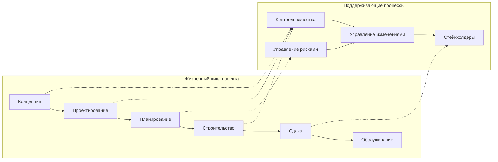
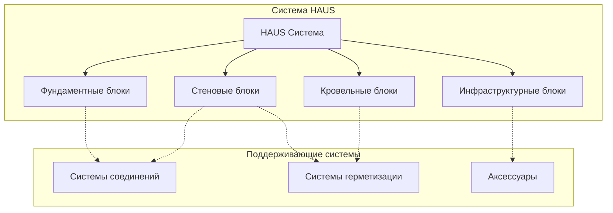

# 🕸️ Граф Знаний Архитектурного Бюро

## 📊 Визуализация Структуры Знаний

```mermaid
graph TB
    %% Стратегический уровень
    A[🎯 STRATEGY] --> A1[Видение]
    A[🎯 STRATEGY] --> A2[Цели]
    A[🎯 STRATEGY] --> A3[ADR]
    A[🎯 STRATEGY] --> A4[Технологии]
    
    %% Проектный уровень
    B[🏗️ PROJECTS] --> B1[Активные]
    B[🏗️ PROJECTS] --> B2[Конвейер]
    B[🏗️ PROJECTS] --> B3[Портфель]
    
    B1 --> P1[Проект A]
    B1 --> P2[Проект B]
    B1 --> P3[Проект C]
    
    P1 --> P1A[Устав]
    P1 --> P1B[Дизайн]
    P1 --> P1C[Документация]
    P1 --> P1D[Строительство]
    P1 --> P1E[Качество]
    
    %% Операционный уровень
    C[🔧 OPERATIONS] --> C1[Методы строительства]
    C[🔧 OPERATIONS] --> C2[Качество]
    C[🔧 OPERATIONS] --> C3[Безопасность]
    C[🔧 OPERATIONS] --> C4[Обслуживание]
    
    %% Ресурсный уровень
    D[📚 RESOURCES] --> D1[Техническая библиотека]
    D[📚 RESOURCES] --> D2[Лучшие практики]
    D[📚 RESOURCES] --> D3[Кейсы]
    D[📚 RESOURCES] --> D4[Исследования]
    
    %% Компонентный уровень
    E[🧱 COMPONENTS] --> E1[HAUS блоки]
    E[🧱 COMPONENTS] --> E2[Соединения]
    E[🧱 COMPONENTS] --> E3[Герметизация]
    E[🧱 COMPONENTS] --> E4[Аксессуары]
    
    E1 --> E1A[Фундаментные]
    E1 --> E1B[Стеновые]
    E1 --> E1C[Кровельные]
    E1 --> E1D[Инфраструктурные]
    
    %% Связи между доменами
    A3 -.-> P1B
    A4 -.-> E1
    C2 -.-> P1E
    D1 -.-> E1
    D2 -.-> C1
    
    %% Стандарты влияют на все
    F[📊 STANDARDS] -.-> A
    F[📊 STANDARDS] -.-> B
    F[📊 STANDARDS] -.-> C
    F[📊 STANDARDS] -.-> D
    F[📊 STANDARDS] -.-> E
    
    %% Аналитика собирает данные от всех
    G[📈 ANALYTICS] -.-> A
    G[📈 ANALYTICS] -.-> B
    G[📈 ANALYTICS] -.-> C
    G[📈 ANALYTICS] -.-> D
    G[📈 ANALYTICS] -.-> E
    
    style A fill:#e1f5fe
    style B fill:#f3e5f5
    style C fill:#e8f5e8
    style D fill:#fff3e0
    style E fill:#fce4ec
    style F fill:#f1f8e9
    style G fill:#fff8e1
```



## 🎯 Центральные Узлы Знаний

### 1. **HAUS Block System** - Главный технический узел
```
HAUS_BLOCKS_SYSTEM
├── Technical_Specifications/
├── Assembly_Instructions/
├── Quality_Standards/
├── Connection_Details/
├── Performance_Data/
└── Case_Studies/
```

**Связи:**
- ← `PROJECTS` (использование в проектах)
- ← `STANDARDS` (соответствие нормам)
- ← `OPERATIONS` (методы монтажа)
- ← `ANALYTICS` (данные производительности)

### 2. **Project Methodology** - Методологический узел
```
PROJECT_METHODOLOGY
├── Phase_Gates/
├── Deliverables/
├── Quality_Gates/
├── Risk_Management/
├── Change_Control/
└── Lessons_Learned/
```

**Связи:**
- ← `STRATEGY` (стратегические цели)
- ← `OPERATIONS` (операционные процессы)
- ← `STANDARDS` (стандарты проектирования)
- → `ANALYTICS` (метрики проектов)

### 3. **Quality System** - Системный узел качества
```
QUALITY_SYSTEM
├── Control_Points/
├── Inspection_Procedures/
├── Testing_Protocols/
├── Certification_Requirements/
├── Corrective_Actions/
└── Continuous_Improvement/
```

**Связи:**
- ← `STANDARDS` (требования качества)
- ← `PROJECTS` (контроль в проектах)
- ← `COMPONENTS` (качество компонентов)
- → `ANALYTICS` (метрики качества)

## 📈 Динамический Граф Связей

### Типы Связей

1. **Иерархические** (`---`)
   - Родитель → Дочерний элемент
   - Агрегация компонентов

2. **Ассоциативные** (`-.->`)
   - Смежные темы
   - Перекрестные ссылки

3. **Зависимости** (`==>`)
   - Причина → Следствие
   - Входы → Процесс → Выходы

4. **Темпоральные** (`~~~`)
   - Версии документов
   - Хронологические связи

### Интерактивная Карта Знаний

```dataview
TABLE WITHOUT ID
  file.link as "Документ",
  file.folder as "Домен",
  file.tags as "Теги",
  length(file.inlinks) as "Входящие ссылки",
  length(file.outlinks) as "Исходящие ссылки"
FROM ""
WHERE file.name != "Template"
SORT length(file.inlinks) DESC
LIMIT 20
```

## 🔍 Анализ Связности

### Метрики Графа

1. **Центральность узлов**
   - Количество входящих связей
   - Количество исходящих связей
   - Промежуточная центральность

2. **Кластеризация**
   - Плотность доменов
   - Межкластерные связи
   - Изолированные узлы

3. **Пути знаний**
   - Кратчайшие пути
   - Альтернативные маршруты
   - Точки отказа

### Индекс Знаний по Доменам

```dataview
TABLE WITHOUT ID
  domain,
  count as "Количество документов",
  avg_connections as "Средняя связность",
  completeness as "Полнота (%)"
FROM #index/domains
SORT completeness DESC
```

## 🎨 Визуальная Навигация

### Цветовая Схема Доменов

- 🔵 **Стратегия** - Синий (Планирование)
- 🟣 **Проекты** - Фиолетовый (Реализация)  
- 🟢 **Операции** - Зеленый (Процессы)
- 🟠 **Ресурсы** - Оранжевый (Знания)
- 🔴 **Компоненты** - Красный (Техника)
- 🟡 **Стандарты** - Желтый (Нормы)
- 🟤 **Аналитика** - Коричневый (Данные)

### Иконки Типов Документов

- 📋 Планы и стратегии
- 🏗️ Проектная документация
- 🔧 Технические процедуры
- 📚 Справочные материалы
- 🧱 Спецификации компонентов
- 📊 Стандарты и нормы
- 📈 Аналитические отчеты
- 👥 Документы стейкхолдеров
- 🔄 Процессы и workflow
- 🗄️ Архивные материалы

## 🔗 Межузловые Соединения

### Проектный Граф


### Техническая Иерархия


## 📋 Навигационные Индексы

### Быстрый Доступ
- [[#Стратегические документы|🎯 Стратегия]]
- [[#Активные проекты|🏗️ Проекты]]  
- [[#Операционные процессы|🔧 Операции]]
- [[#Техническая библиотека|📚 Ресурсы]]
- [[#HAUS блоки|🧱 Компоненты]]

### Поиск по Контексту
```dataview
LIST
FROM #context
WHERE contains(file.name, this.query)
GROUP BY file.folder
```

### Недавние Обновления
```dataview
TABLE WITHOUT ID
  file.link as "Документ",
  file.mday as "Дата изменения",
  file.folder as "Домен"
FROM ""
WHERE file.mday >= date(today) - dur(7 days)
SORT file.mday DESC
```

---

## 🎯 Рекомендации по Использованию

1. **Начните с центральных узлов** - используйте HAUS Block System как отправную точку
2. **Следуйте связям** - переходите по ассоциативным ссылкам для изучения смежных тем  
3. **Используйте фильтры** - применяйте теги для поиска релевантной информации
4. **Обновляйте связи** - добавляйте новые связи при создании документов
5. **Отслеживайте метрики** - используйте аналитику для оптимизации структуры

*Граф знаний является живой структурой, которая развивается вместе с проектами и накоплением опыта.* 