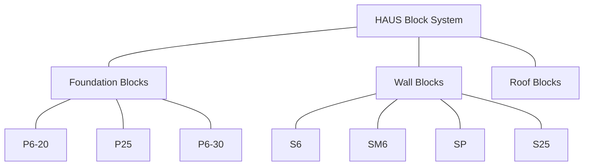
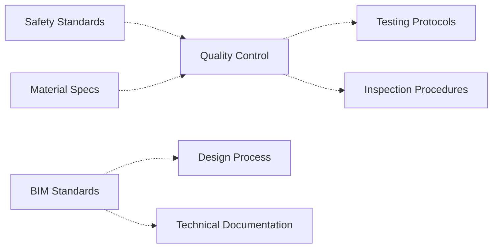
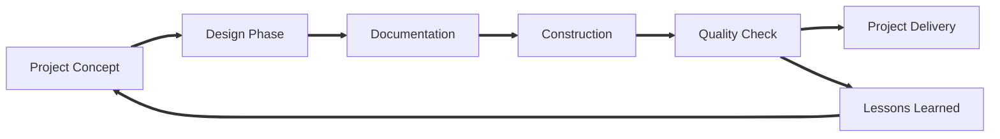
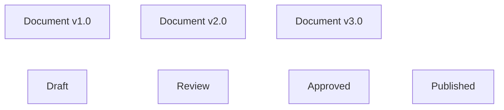
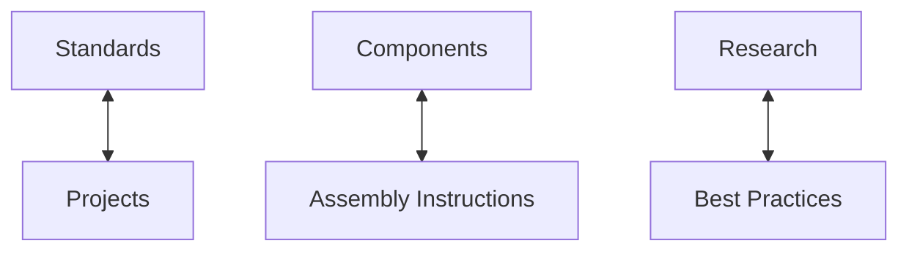
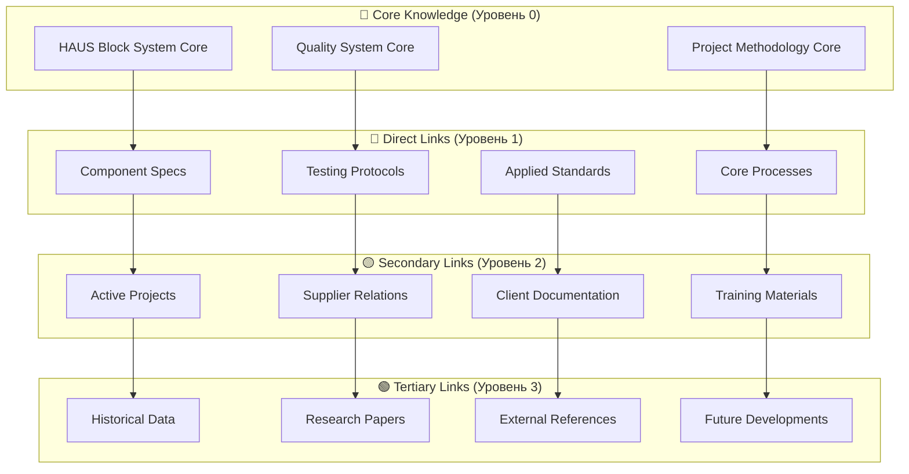

# 🕸️ Мастер-Карта Графовых Взаимосвязей Архитектурного Бюро

> *"सर्वे भवन्तु सुखिनः सर्वे सन्तु निरामयाः" (Да будут все счастливы, да будут все здоровы) - как учит нас Мантра Всеобщего Благополучия. В архитектуре, как и в жизни, все элементы взаимосвязаны и влияют друг на друга.*

## 🎯 Философия Графового Мышления

Данная карта построена на принципах **индуизма о взаимосвязанности всего сущего** и современных методологиях **knowledge management**:

- **Адвайта-Веданта**: Все есть единое целое, части взаимопроникают друг в друга
- **Graph Theory**: Узлы (документы) + связи (relationships) = знания
- **Network Effects**: Сила системы растет экспоненциально от количества связей
- **Emergence**: Новые идеи возникают на пересечении знаний

## 🏗️ Типология Связей в Архитектурной Документации

### 1. **Структурные Связи** (🔗 `---`)
**Определение:** Фундаментальные, иерархические связи "родитель-дочерний элемент"



**Примеры связей:**
- [[06_COMPONENTS/haus_blocks/foundation]] → [[P6-20 Foundation Block]]
- [[02_PROJECTS/active/residential_complex]] → [[Project Charter]]
- [[00_STRUCTURE_GUIDE]] → [[01_KNOWLEDGE_GRAPH]]

### 2. **Семантические Связи** (🌐 `-.->`)
**Определение:** Контекстные связи по смыслу, теме, области применения



**Примеры связей:**
- [[Fire Resistance Specifications]] ←→ [[Safety Protocols]]
- [[BIM TEKLA Components]] ←→ [[Structural Solutions]]
- [[Quality Control]] ←→ [[Testing Protocols]]

### 3. **Процессные Связи** (⚡ `==>`)
**Определение:** Связи по последовательности в бизнес-процессах



**Примеры связей:**
- [[Project Charter]] ⇒ [[Architectural Design]] ⇒ [[Technical Documentation]]
- [[Material Selection]] ⇒ [[Procurement]] ⇒ [[Quality Testing]]

### 4. **Темпоральные Связи** (🕒 `~~~`)
**Определение:** Связи по времени, версиям, эволюции документов



**Примеры связей:**
- [[CE Data Sheet HAUS P6-20 v1.0]] ↗ [[CE Data Sheet HAUS P6-20 v2.0]]
- [[Project Timeline March]] ↗ [[Project Timeline April]]

### 5. **Референсные Связи** (📚 `<->`)
**Определение:** Взаимные ссылки, цитирования, зависимости



**Примеры связей:**
- [[VGTU Test Protocols]] ↔ [[Quality Standards]]
- [[Usage Instructions]] ↔ [[Component Specifications]]

## 🎨 Мастер-Граф Всех Связей

### Центральная Звезда Знаний

```mermaid
graph TB
    %% Центральные узлы знаний
    CORE{🏗️ АРХИТЕКТУРНОЕ БЮРО}
    
    %% Основные домены
    CORE --- ADMIN[📋 00_ADMIN]
    CORE --- STRATEGY[🎯 01_STRATEGY] 
    CORE --- PROJECTS[🏗️ 02_PROJECTS]
    CORE --- OPERATIONS[🔧 03_OPERATIONS]
    CORE --- RESOURCES[📚 04_RESOURCES]
    CORE --- STAKEHOLDERS[👥 05_STAKEHOLDERS]
    CORE --- COMPONENTS[🧱 06_COMPONENTS]
    CORE --- STANDARDS[📊 07_STANDARDS]
    CORE --- WORKFLOWS[🔄 08_WORKFLOWS]
    CORE --- ANALYTICS[📈 09_ANALYTICS]
    
    %% КОМПОНЕНТНЫЙ ДОМЕН (детализация)
    COMPONENTS --- HAUS_SYSTEM[HAUS Block System]
    HAUS_SYSTEM --- FOUNDATION[Foundation Blocks]
    HAUS_SYSTEM --- WALL[Wall Blocks]
    HAUS_SYSTEM --- ROOF[Roof Blocks]
    HAUS_SYSTEM --- INFRA[Infrastructure Blocks]
    
    %% Foundation блоки
    FOUNDATION --- P620[P6-20]
    FOUNDATION --- P25[P25]
    FOUNDATION --- P630[P6-30]
    FOUNDATION --- KL28[KL28]
    
    %% Wall блоки
    WALL --- S6[S6]
    WALL --- SM6[SM6]
    WALL --- SP[SP]
    WALL --- S25[S25]
    
    %% Roof и специальные блоки
    ROOF --- CHIMNEY[Chimney Blocks KL28]
    INFRA --- VENTILATION[Ventilation Blocks VB2]
    
    %% РЕСУРСНЫЙ ДОМЕН
    RESOURCES --- CAD_BIM[CAD/BIM Library]
    RESOURCES --- STRUCTURAL[Structural Solutions]
    RESOURCES --- TESTING[Testing Protocols]
    RESOURCES --- CERTIFICATES[Certificates & CE Data]
    
    %% Технические документы
    CAD_BIM --- BIM_TEKLA[BIM TEKLA Components]
    STRUCTURAL --- KONSTRUKCINIAI[Konstrukciniai Sprendimai]
    TESTING --- VGTU[VGTU Test Protocols]
    TESTING --- KTU[KTU Airtightness Tests]
    CERTIFICATES --- CE_SHEETS[CE Data Sheets]
    CERTIFICATES --- FIRE_RESISTANCE[Fire Resistance Specs]
    
    %% ПРОЦЕССНЫЙ ДОМЕН
    WORKFLOWS --- DESIGN_PROCESS[Design Process]
    WORKFLOWS --- CONSTRUCTION_PROCESS[Construction Process]
    WORKFLOWS --- QUALITY_PROCESS[Quality Control Process]
    
    %% Строительные процессы (из builders/)
    CONSTRUCTION_PROCESS --- MASONRY[Masonry Process]
    CONSTRUCTION_PROCESS --- FOUNDATION_WORK[Foundation Work]
    CONSTRUCTION_PROCESS --- RING_BEAM[Ring Beam Installation]
    CONSTRUCTION_PROCESS --- PARTITION[Partition Installation]
    
    %% ОПЕРАЦИОННЫЙ ДОМЕН
    OPERATIONS --- CONSTRUCTION_METHODS[Construction Methods]
    OPERATIONS --- QUALITY_ASSURANCE[Quality Assurance]
    OPERATIONS --- SAFETY_PROTOCOLS[Safety Protocols]
    
    %% Конструкторские решения (из constructors/)
    CONSTRUCTION_METHODS --- RETAINING_WALL[Retaining Wall Systems]
    CONSTRUCTION_METHODS --- HIDDEN_FRAME[Hidden Frame Systems]
    CONSTRUCTION_METHODS --- STRIP_FOUNDATION[Strip Foundation]
    CONSTRUCTION_METHODS --- MONOLITHIC_RING[Monolithic Ring]
    
    %% СТАНДАРТЫ И НОРМЫ
    STANDARDS --- BUILDING_CODES[Building Codes]
    STANDARDS --- QUALITY_STANDARDS[Quality Standards]
    STANDARDS --- BIM_STANDARDS[BIM Standards]
    STANDARDS --- SAFETY_REGULATIONS[Safety Regulations]
    
    %% КРОСС-ДОМЕННЫЕ СВЯЗИ
    %% Качество пронизывает все
    QUALITY_ASSURANCE -.-> P620
    QUALITY_ASSURANCE -.-> SM6
    QUALITY_ASSURANCE -.-> VGTU
    QUALITY_ASSURANCE -.-> CE_SHEETS
    
    %% BIM связывает проектирование и компоненты
    BIM_STANDARDS -.-> BIM_TEKLA
    BIM_STANDARDS -.-> CAD_BIM
    BIM_STANDARDS -.-> DESIGN_PROCESS
    
    %% Стандарты влияют на все процессы
    BUILDING_CODES -.-> CONSTRUCTION_METHODS
    SAFETY_REGULATIONS -.-> SAFETY_PROTOCOLS
    QUALITY_STANDARDS -.-> QUALITY_PROCESS
    
    %% Процессы используют компоненты
    MASONRY ==> S6
    MASONRY ==> SM6
    MASONRY ==> SP
    FOUNDATION_WORK ==> P620
    FOUNDATION_WORK ==> P25
    FOUNDATION_WORK ==> P630
    
    %% Цветовое кодирование
    style CORE fill:#ff6b6b,stroke:#333,stroke-width:4px
    style HAUS_SYSTEM fill:#4ecdc4,stroke:#333,stroke-width:3px
    style COMPONENTS fill:#45b7d1,stroke:#333,stroke-width:2px
    style RESOURCES fill:#f9ca24,stroke:#333,stroke-width:2px
    style WORKFLOWS fill:#f0932b,stroke:#333,stroke-width:2px
    style STANDARDS fill:#eb4d4b,stroke:#333,stroke-width:2px
    style OPERATIONS fill:#6c5ce7,stroke:#333,stroke-width:2px
```



## 📊 Матрица Связей по Доменам

| Домен | COMPONENTS | RESOURCES | WORKFLOWS | STANDARDS | OPERATIONS |
|-------|------------|-----------|-----------|-----------|------------|
| **COMPONENTS** | 🔗 Internal hierarchy | 📚 Tech docs, specs | ⚡ Assembly processes | 📊 Quality standards | 🔧 Installation methods |
| **RESOURCES** | 📚 Component catalogs | 🔗 Cross-references | ⚡ Research → Practice | 📊 Standards compliance | 🔧 Best practices |
| **WORKFLOWS** | ⚡ Component selection | ⚡ Resource utilization | 🔗 Process chains | 📊 Process standards | 🔧 Operational procedures |
| **STANDARDS** | 📊 Component standards | 📊 Reference standards | 📊 Process compliance | 🔗 Standards hierarchy | 📊 Safety regulations |
| **OPERATIONS** | 🔧 Component operations | 🔧 Operational resources | 🔧 Standard operations | 📊 Compliance checks | 🔗 Method families |

## 🎯 MOC (Maps of Content) Структура

### 🗺️ Главные Навигационные MOC

#### 1. **HAUS_System_MOC** - Центральная техническая карта
```markdown
# 🧱 HAUS System MOC

## Foundation Blocks
- [[P6-20 Foundation Block]] - 20cm concrete formwork
- [[P25 Foundation Block]] - 25cm concrete formwork  
- [[P6-30 Foundation Block]] - 30cm concrete formwork
- [[KL28 Foundation Block]] - Special foundation type

## Wall Blocks
- [[S6 Masonry Block]] - 20cm masonry standard
- [[SM6 Masonry Block]] - 20cm masonry reinforced
- [[SP Partition Block]] - 10cm partition walls
- [[S25 Masonry Block]] - 25cm masonry heavy-duty

## Support Systems
- [[Connection Systems]] - Inter-block connections
- [[Sealing Systems]] - Weatherproofing solutions
- [[Reinforcement Systems]] - Structural reinforcement

## Technical Documentation
- [[BIM TEKLA Components]] - Parametric models
- [[CAD/BIM Library]] - 3D models library
- [[Assembly Instructions]] - Installation guides
- [[Quality Control Procedures]] - QC protocols

## Testing & Compliance
- [[VGTU Test Protocols]] - University testing results
- [[KTU Airtightness Tests]] - Thermal performance data
- [[CE Data Sheets]] - European compliance
- [[Fire Resistance Specifications]] - Safety certifications

## Related Projects
- [[Active Projects Using HAUS]] - Current implementations
- [[Case Studies]] - Successful applications
- [[Lessons Learned]] - Experience feedback
```

#### 2. **Quality_System_MOC** - Система качества
```markdown
# ✅ Quality System MOC

## Quality Standards
- [[ISO 9001 Implementation]] - Quality management system
- [[Building Code Compliance]] - Regulatory requirements
- [[BIM Standards]] - Digital quality standards

## Testing Protocols
- [[Material Testing]] → [[VGTU Test Protocols]]
- [[Performance Testing]] → [[KTU Airtightness Tests]]
- [[Safety Testing]] → [[Fire Resistance Specifications]]
- [[Compliance Testing]] → [[CE Data Sheets]]

## Quality Control Process
- [[Design Quality Gates]] - Design review checkpoints
- [[Manufacturing QC]] - Production quality control
- [[Installation QC]] - On-site quality assurance
- [[Final Inspection]] - Delivery quality verification

## Quality Metrics
- [[Performance Indicators]] - KPI dashboard
- [[Quality Reports]] - Periodic assessments
- [[Customer Satisfaction]] - Feedback analysis
- [[Continuous Improvement]] - Process optimization

## Cross-References
- **Projects:** [[Project Quality Plans]]
- **Operations:** [[Quality Assurance Procedures]]
- **Components:** [[Component Quality Standards]]
- **Workflows:** [[Quality Review Process]]
```

#### 3. **Construction_Process_MOC** - Процессы строительства
```markdown
# 🏗️ Construction Process MOC

## Pre-Construction
- [[Site Preparation]] - Ground preparation procedures
- [[Material Planning]] - Component procurement
- [[Equipment Setup]] - Tool and machinery preparation

## Foundation Phase
- [[Foundation Work]] → [[Strip Foundation]], [[Ring Beam]]
- [[Foundation Blocks]] → [[P6-20]], [[P25]], [[P6-30]]
- [[Quality Check Foundation]] - Foundation inspection

## Wall Construction  
- [[Masonry Process]] → [[Wall Assembly Procedures]]
- [[Wall Blocks]] → [[S6]], [[SM6]], [[SP]], [[S25]]
- [[Connection Details]] → [[Structural Solutions]]

## Specialized Systems
- [[Hidden Frame Systems]] - Advanced framing
- [[Retaining Wall Systems]] - Support structures
- [[Partition Installation]] - Interior walls

## Quality Assurance
- [[Construction QC]] - On-site quality control
- [[Safety Protocols]] - Construction safety
- [[Progress Monitoring]] - Timeline tracking

## Documentation
- [[Construction Drawings]] - Technical drawings
- [[As-Built Documentation]] - Final documentation
- [[Handover Procedures]] - Project delivery
```

## 🔍 Динамические Запросы для Автоматических Связей

### Dataview Query: Связанные по тегам
```dataview
TABLE WITHOUT ID
  file.link as "Document",
  file.tags as "Tags",
  length(file.inlinks) as "↗️ In",
  length(file.outlinks) as "↪️ Out",
  choice(length(file.inlinks) + length(file.outlinks) > 10, "🔥 Hub", 
         choice(length(file.inlinks) + length(file.outlinks) > 5, "🌟 Active", "📄 Basic")) as "Status"
FROM ""
WHERE contains(string(file.tags), "haus-block") OR contains(string(file.tags), "construction") OR contains(string(file.tags), "quality")
SORT (length(file.inlinks) + length(file.outlinks)) DESC
```

### Dataview Query: Компоненты по типам
```dataview
LIST
FROM ""
WHERE contains(file.folder, "blocks") OR contains(file.folder, "components")
GROUP BY file.folder
SORT file.folder ASC
```

### Dataview Query: Последние обновления с связями
```dataview
TABLE WITHOUT ID
  file.link as "Document",
  file.mdate as "Modified",
  length(file.outlinks) as "Links Out",
  file.folder as "Domain"
FROM ""
WHERE file.mdate >= date(today) - dur(30 days)
SORT file.mdate DESC
LIMIT 15
```

## 🌊 Волновая Модель Распространения Знаний

### Концентрические Круги Влияния



## 🎭 Роли Документов в Графе

### 📍 **Узлы-Хабы** (High Connectivity)
- [[HAUS Block System]] - Центральный технический узел
- [[Quality Control]] - Процессный хаб
- [[BIM Standards]] - Методологический хаб
- [[Project Templates]] - Проектный хаб

### 🌉 **Узлы-Мосты** (Bridge Nodes)
- [[Structural Solutions]] - Связывает дизайн с производством
- [[Usage Instructions]] - Связывает компоненты с процессами
- [[Test Protocols]] - Связывает качество с компонентами

### 📚 **Узлы-Библиотеки** (Reference Nodes)
- [[CE Data Sheets]] - Нормативная база
- [[CAD/BIM Library]] - Техническая база
- [[Best Practices]] - Методическая база

### 🔄 **Узлы-Процессы** (Process Nodes)
- [[Design Process]] - Проектный процесс
- [[Construction Process]] - Строительный процесс
- [[Quality Process]] - Процесс контроля качества

## 🎨 Визуальные Паттерны Связей

### Цветовая Схема Связей
- 🔴 **Критические связи** - Без них система не работает
- 🟠 **Важные связи** - Значительно влияют на функциональность
- 🟡 **Полезные связи** - Улучшают навигацию и понимание
- 🟢 **Контекстные связи** - Предоставляют дополнительную информацию
- 🔵 **Исследовательские связи** - Для будущего развития

### Иконки Типов Узлов
- 🏗️ **Проектные документы** - Project-related content
- 🧱 **Компоненты** - Physical components and specifications
- ⚙️ **Процессы** - Workflows and procedures
- 📊 **Стандарты** - Standards and regulations
- 📚 **Ресурсы** - Reference materials and libraries
- 👥 **Стейкхолдеры** - People and organization-related
- 📈 **Аналитика** - Metrics and analysis
- 🗄️ **Архив** - Historical and completed items

## 🚀 Автоматизация Управления Связями

### Шаблоны для Новых Документов
```markdown
---
type: [component/process/standard/project]
domain: [00-09 domain code]
status: [draft/review/approved/published]
created: {{date}}
modified: {{date}}
tags: [#primary-tag, #secondary-tag, #domain-tag]
related_to: [[]]
depends_on: [[]]
influences: [[]]
version: 1.0
---

# {{title}}

## Связи
- **Родительский документ:** [[]]
- **Связанные документы:** [[]], [[]]
- **Зависимые документы:** [[]], [[]]
- **Влияет на:** [[]], [[]]

## Обратные связи
```dataview
LIST
FROM [[{{title}}]]
```

## Связанные теги
```dataview
TABLE file.link, file.tags
FROM #your-main-tag
WHERE file.name != "{{title}}"
```
```

### Автоматические Проверки Связности
```dataview
TABLE WITHOUT ID
  file.link as "Потенциально изолированный документ",
  length(file.inlinks) as "Входящие связи",
  length(file.outlinks) as "Исходящие связи"
FROM ""
WHERE length(file.inlinks) = 0 AND length(file.outlinks) < 2
SORT file.name ASC
```

## ⚡ Протоколы Поддержания Графа

### Еженедельный Аудит Связей
1. **Проверка изолированных узлов** - Документы без связей
2. **Анализ хабов** - Перегруженные узлы, требующие декомпозиции
3. **Качество связей** - Релевантность и актуальность связей
4. **Новые возможности** - Потенциальные связи между существующими документами

### Месячная Оптимизация
1. **Реструктуризация хабов** - Создание новых MOC для больших узлов
2. **Архивирование** - Перенос устаревших связей в архив
3. **Метаанализ** - Выявление паттернов использования графа
4. **Планирование развития** - Определение приоритетных областей для связывания

---

## 🙏 Мантра Графовых Связей

> **"यत्र योगेश्वरः कृष्णो यत्र पार्थो धनुर्धरः।  
> तत्र श्रीर्विजयो भूतिर्ध्रुवा नीतिर्मतिर्मम॥"**
> 
> *"Где Кришна - владыка йоги, где Арджуна - лучник,  
> там процветание, победа, благополучие и незыблемая мудрость"*
> 
> **Современная интерпретация:** Где есть системное мышление (Кришна) и точное исполнение (Арджуна), там возникает синергия знаний, эффективность процессов, устойчивое развитие и мудрые решения.

*Граф знаний живет и развивается. Каждая новая связь усиливает всю систему. Каждое удаление укрепляет оставшуюся структуру. В единстве связей рождается мудрость архитектурного мастерства.* 🕉️ 