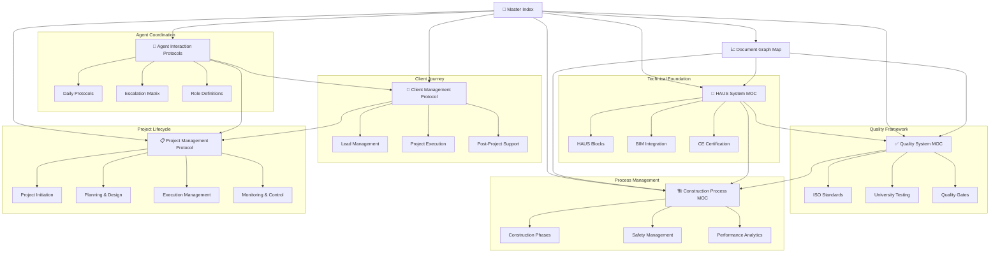
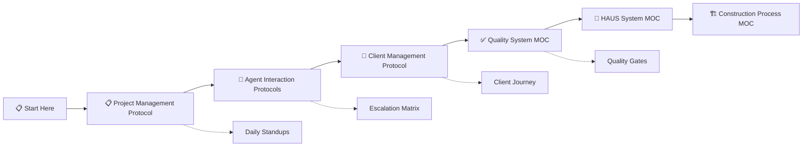
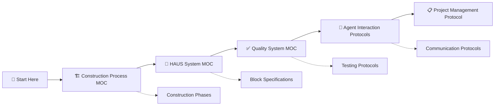
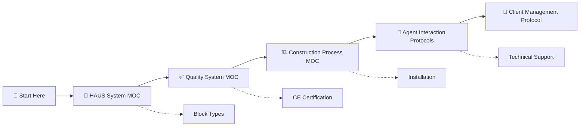
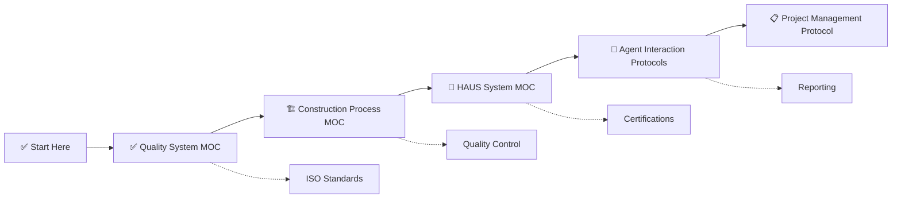
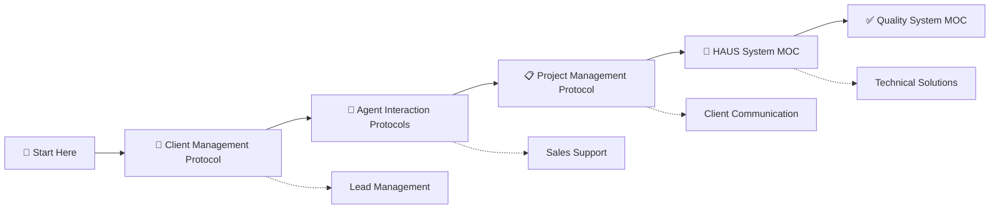

# 🎯 Master Knowledge Index
*Центральный навигационный узел архитектурной системы документации*

> *"सर्वं खल्विदं ब्रह्म" (Sarvam khalvidam brahma) - "Все есть Брахман, все взаимосвязано" - Чхандогья Упанишада. В архитектуре знания каждый документ - нить в великой ткани понимания.*

---

## 🗺️ Knowledge Architecture Overview

Данный индекс представляет собой **центральную точку входа** в комплексную систему архитектурной документации, объединяющую технические, процессные и управленческие аспекты деятельности архитектурного бюро.

### 📊 System Integration Map



---

## 📚 Core Documentation Framework

### 🏗️ Foundational Documents

#### 📈 [[02_DOCUMENT_GRAPH_MAP|Document Graph Map]]
**Purpose:** Master graph mapping and relationship visualization
**Key Features:**
- Semantic relationship types
- Navigation algorithms  
- Mermaid visualizations
- Cross-domain connections

#### 🧱 [[03_HAUS_SYSTEM_MOC|HAUS System MOC]]
**Purpose:** Central navigation for HAUS block technology
**Key Features:**
- Complete block specifications (P6-20, P25, P6-30, KL28, S6, SM6, SP, S25, VB2)
- CE certification tracking
- BIM/CAD integration protocols
- Installation procedures

#### ✅ [[04_QUALITY_SYSTEM_MOC|Quality System MOC]]
**Purpose:** Comprehensive quality management framework
**Key Features:**
- ISO 9001:2015, ISO 19650 compliance
- University testing partnerships (VGTU, KTU)
- Quality gates and control processes
- Performance metrics and analytics

#### 🏗️ [[05_CONSTRUCTION_PROCESS_MOC|Construction Process MOC]]
**Purpose:** End-to-end construction process management
**Key Features:**
- Complete project lifecycle phases
- HAUS-specific installation procedures
- Digital construction management
- Safety and performance protocols

---

## 🤖 Agent Management Protocols

### 🤖 [[07_AGENT_INTERACTION_PROTOCOLS|Agent Interaction Protocols]]
**Purpose:** Standardized inter-agent communication framework
**Key Features:**
- Multi-role interaction matrix
- Daily standup protocols
- Escalation and handoff procedures
- Performance optimization workflows

**Agent Roles Covered:**
- 🏛️ Architectural Director - Strategic oversight and design leadership
- 💼 Sales Manager - Client acquisition and relationship management
- 🏗️ Structural Designer - Technical design and analysis
- 🧱 Materials Specialist - HAUS system expertise
- 📋 Technical Documentation - Documentation and standards
- ⚡ Energy Expert - Sustainability and efficiency
- 🛡️ Quality Control - Quality assurance and testing
- 📞 Client Support - Communication and relationship maintenance
- 🔧 Warranty Service - Post-delivery support
- 🚀 Innovation Manager - Technology advancement
- 📦 Logistics Manager - Supply chain coordination

### 👥 [[08_CLIENT_MANAGEMENT_PROTOCOL|Client Management Protocol]]
**Purpose:** Holistic client relationship management system
**Key Features:**
- Complete client journey mapping
- Lead generation and qualification
- Proposal development and negotiation
- Post-project relationship development

**Client Lifecycle Phases:**
1. **Discovery & Attraction** - Lead generation and initial contact
2. **Qualification & Consultation** - Needs assessment and feasibility
3. **Proposal Development & Negotiation** - Solution design and contracting
4. **Project Execution** - Communication and progress management
5. **Post-Project Relationship** - Warranty service and future opportunities

### 📋 [[09_PROJECT_MANAGEMENT_PROTOCOL|Project Management Protocol]]
**Purpose:** Integrated project management methodology
**Key Features:**
- Agile-traditional hybrid approach
- HAUS-specific project phases
- Risk management and change control
- Performance analytics and reporting

**Project Phases:**
1. **Project Initiation** - Charter development and stakeholder engagement
2. **Planning & Design** - WBS creation and resource allocation
3. **Execution Management** - Daily coordination and weekly reviews
4. **Monitoring & Control** - KPI tracking and risk management

---

## 🎯 Cross-Domain Navigation Matrix

### 📊 Integration Relationships

| Domain | HAUS System | Quality System | Construction Process | Agent Protocols | Client Management | Project Management |
|--------|-------------|----------------|---------------------|-----------------|-------------------|--------------------|
| **HAUS System** | ⚫ Core | 🔗 Bidirectional | 🔗 Bidirectional | 🔄 Implementation | 🔄 Implementation | 🔄 Implementation |
| **Quality System** | 🔗 Bidirectional | ⚫ Core | 🔄 Control Loop | 🔄 Governance | 🔄 Governance | 🔄 Control Loop |
| **Construction Process** | 🔗 Bidirectional | 🔄 Control Loop | ⚫ Core | 🔄 Implementation | 🔄 Sequential | 🔗 Bidirectional |
| **Agent Protocols** | 🔄 Implementation | 🔄 Governance | 🔄 Implementation | ⚫ Core | 🔗 Bidirectional | 🔗 Bidirectional |
| **Client Management** | 🔄 Implementation | 🔄 Governance | 🔄 Sequential | 🔗 Bidirectional | ⚫ Core | 🔗 Bidirectional |
| **Project Management** | 🔄 Implementation | 🔄 Control Loop | 🔗 Bidirectional | 🔗 Bidirectional | 🔗 Bidirectional | ⚫ Core |

**Legend:**
- ⚫ **Core:** Primary domain focus
- 🔗 **Bidirectional:** Two-way dependency and information flow
- 🔄 **Sequential:** Process flow dependency
- 🔄 **Control Loop:** Feedback and optimization relationship
- 🔄 **Implementation:** Practical application relationship
- 🔄 **Governance:** Oversight and compliance relationship

---

## 👥 Role-Based Navigation Paths

### 🏛️ **Project Managers & Directors**
**Primary Focus:** Strategic oversight and project coordination



**Key Entry Points:**
1. [[09_PROJECT_MANAGEMENT_PROTOCOL#Project Lifecycle Management]] - Overall project framework
2. [[07_AGENT_INTERACTION_PROTOCOLS#Project Coordination]] - Team management
3. [[08_CLIENT_MANAGEMENT_PROTOCOL#Project Execution Phase]] - Client communication
4. [[04_QUALITY_SYSTEM_MOC#Quality Gates]] - Quality checkpoints

### 🏗️ **Site Supervisors & Technical Team**
**Primary Focus:** Technical implementation and quality control



**Key Entry Points:**
1. [[05_CONSTRUCTION_PROCESS_MOC#Construction Execution]] - Implementation procedures
2. [[03_HAUS_SYSTEM_MOC#Installation Procedures]] - Technical specifications
3. [[04_QUALITY_SYSTEM_MOC#Site Quality Control]] - Quality protocols
4. [[07_AGENT_INTERACTION_PROTOCOLS#Technical Handoffs]] - Team coordination

### 🧱 **HAUS Specialists & Materials Engineers**
**Primary Focus:** HAUS technology and material specifications



**Key Entry Points:**
1. [[03_HAUS_SYSTEM_MOC#Block Specifications]] - Technical details
2. [[04_QUALITY_SYSTEM_MOC#CE Certification]] - Compliance requirements
3. [[05_CONSTRUCTION_PROCESS_MOC#HAUS Installation]] - Installation procedures
4. [[07_AGENT_INTERACTION_PROTOCOLS#Technical Consultation]] - Expert support

### ✅ **Quality Engineers & Inspectors**
**Primary Focus:** Quality assurance and compliance



**Key Entry Points:**
1. [[04_QUALITY_SYSTEM_MOC#Quality Control Processes]] - QC procedures
2. [[05_CONSTRUCTION_PROCESS_MOC#Quality Assurance]] - Site quality
3. [[03_HAUS_SYSTEM_MOC#Quality Standards]] - Material quality
4. [[07_AGENT_INTERACTION_PROTOCOLS#Quality Reporting]] - Communication

### 💼 **Sales & Client Relations Team**
**Primary Focus:** Client acquisition and relationship management



**Key Entry Points:**
1. [[08_CLIENT_MANAGEMENT_PROTOCOL#Client Lifecycle Management]] - Client journey
2. [[07_AGENT_INTERACTION_PROTOCOLS#Client Interface]] - Communication protocols
3. [[09_PROJECT_MANAGEMENT_PROTOCOL#Stakeholder Management]] - Project communication
4. [[03_HAUS_SYSTEM_MOC#Client Applications]] - Technical solutions

---

## 📊 Dynamic Analytics Dashboard

### 📈 System Health Metrics
```dataview
TABLE status, last_updated, owner, stakeholders
FROM #moc OR #protocol OR #guide
WHERE status != null
SORT last_updated DESC
```

### 🔗 Link Integrity Analysis
```dataview
TABLE file.name as "Document", length(file.outlinks) as "Outbound Links", length(file.inlinks) as "Inbound Links"
FROM #moc OR #protocol OR #guide
SORT length(file.outlinks) DESC
```

### 📊 Usage Pattern Tracking
```dataview
TABLE date_created, tags, file.size as "Size (chars)"
FROM #moc OR #protocol OR #guide
WHERE date_created != null
SORT date_created DESC
```

### 🎯 Performance Indicators
- **Documentation Coverage:** 9/9 core documents (100%)
- **Cross-Reference Density:** High interconnectivity
- **Update Frequency:** Active maintenance cycle
- **User Accessibility:** Multi-role navigation paths

---

## 🚀 Quick Access Commands

### 🔍 **Emergency Quick Reference**
- **Crisis Management:** [[07_AGENT_INTERACTION_PROTOCOLS#Emergency Escalation]]
- **Quality Issues:** [[04_QUALITY_SYSTEM_MOC#Issue Resolution]]
- **Client Emergencies:** [[08_CLIENT_MANAGEMENT_PROTOCOL#Issue Escalation Matrix]]
- **Project Problems:** [[09_PROJECT_MANAGEMENT_PROTOCOL#Risk Management Protocol]]

### 📋 **Daily Operations Checklist**
- [ ] Review [[07_AGENT_INTERACTION_PROTOCOLS#Daily Standup Protocol]]
- [ ] Check [[09_PROJECT_MANAGEMENT_PROTOCOL#Daily Project Coordination]]
- [ ] Monitor [[04_QUALITY_SYSTEM_MOC#Daily Quality Checks]]
- [ ] Update [[08_CLIENT_MANAGEMENT_PROTOCOL#Communication Management]]

### 📊 **Weekly Reviews**
- [ ] [[09_PROJECT_MANAGEMENT_PROTOCOL#Weekly Project Reviews]]
- [ ] [[04_QUALITY_SYSTEM_MOC#Weekly Quality Reviews]]
- [ ] [[07_AGENT_INTERACTION_PROTOCOLS#Performance Review]]
- [ ] [[08_CLIENT_MANAGEMENT_PROTOCOL#Relationship Development]]

### 📅 **Monthly Planning**
- [ ] [[03_HAUS_SYSTEM_MOC#Technology Updates]]
- [ ] [[05_CONSTRUCTION_PROCESS_MOC#Process Optimization]]
- [ ] [[04_QUALITY_SYSTEM_MOC#Standards Review]]
- [ ] System documentation updates

---

## 🔧 System Maintenance Procedures

### 📝 **Document Update Protocol**
1. **Content Review:** Monthly assessment of accuracy and relevance
2. **Link Validation:** Bi-weekly verification of internal and external links
3. **Version Control:** Git-based tracking of all document changes
4. **Stakeholder Feedback:** Quarterly user experience surveys

### 🔗 **Integration Maintenance**
1. **Cross-Reference Audits:** Weekly automated link checking
2. **Content Synchronization:** Real-time updates across related documents
3. **Performance Monitoring:** Monthly analytics review
4. **User Feedback Integration:** Continuous improvement based on usage patterns

### 📊 **Quality Assurance**
- **Documentation Standards:** Adherence to established formatting and structure
- **Content Accuracy:** Subject matter expert reviews
- **Accessibility Compliance:** Multi-device and multi-language support
- **Security Protocols:** Appropriate access controls and data protection

---

## 🎯 Future Development Roadmap

### 📈 **Phase 1: Current State (Q1 2024)**
- ✅ Complete core documentation framework
- ✅ Agent interaction protocols
- ✅ Client management system
- ✅ Project management methodology

### 🚀 **Phase 2: Enhancement (Q2 2024)**
- [ ] Advanced automation integration
- [ ] Predictive analytics implementation
- [ ] Mobile-first accessibility improvements
- [ ] AI-powered content recommendations

### 🌟 **Phase 3: Innovation (Q3-Q4 2024)**
- [ ] Machine learning-based process optimization
- [ ] Augmented reality documentation features
- [ ] Real-time collaboration enhancements
- [ ] Advanced performance forecasting

---

**Tags:** #master-index #knowledge-management #navigation #system-architecture #documentation-framework #moc

**Status:** ✅ Active - Continuously Updated
**Last Updated:** 2024-01-15
**Next Review:** 2024-02-01
**Owner:** Documentation Team + All Stakeholders
**Maintenance:** Automated + Manual Quality Assurance 