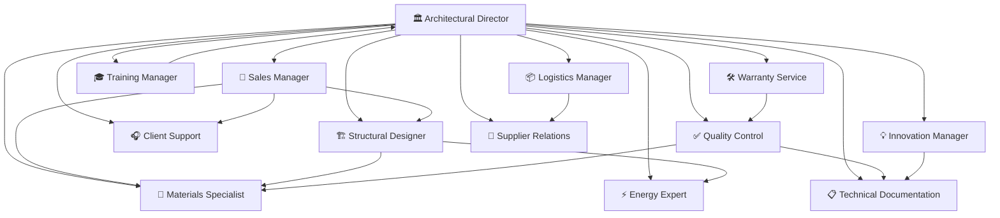
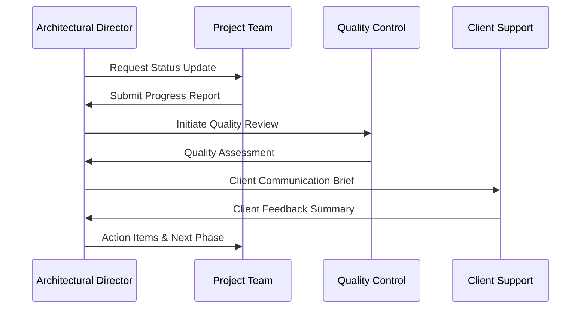
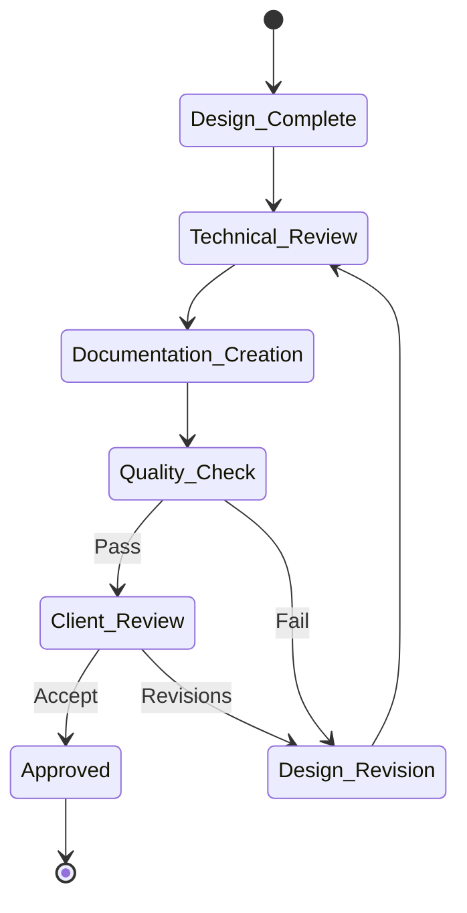
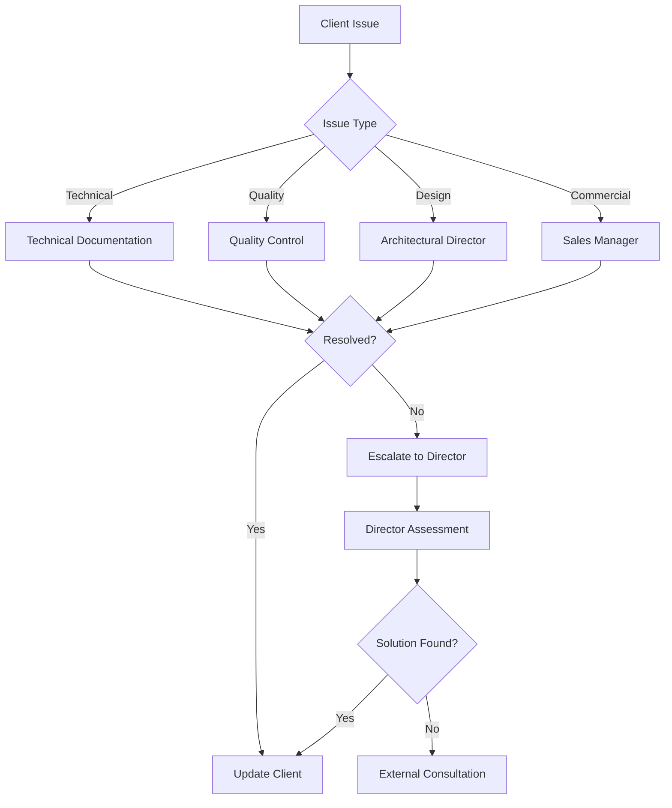
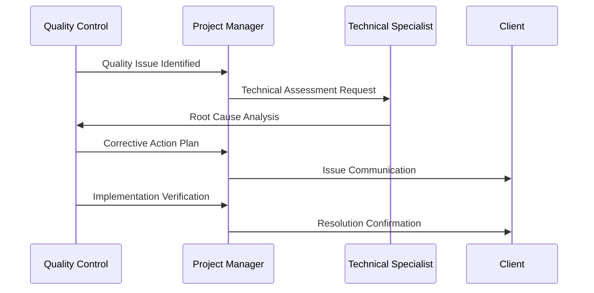
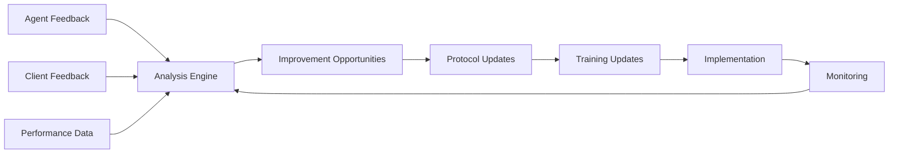

# 🤖 Agent Interaction Protocols
*Протоколы взаимодействия нейро-команды архитектурного бюро*

> *"यत्र नार्यस्तु पूज्यन्ते रमन्ते तत्र देवताः" (Где женщины почитаемы, там обитают боги) - принцип гармоничного взаимодействия из Ману-смрити. В архитектуре команды, как и в семье, успех рождается из взаимного уважения и четкого понимания ролей.*

---

## 🎯 Overview: Протокольная Архитектура

Данный документ определяет **стандартизированные протоколы взаимодействия** между агентами нейро-команды, обеспечивая эффективность, прозрачность и качество совместной работы.

### 📊 Interaction Matrix



### 🏗️ Structural Framework

1. **[[#Core Communication Protocols]]** - Базовые принципы коммуникации
2. **[[#Agent-to-Agent Workflows]]** - Специфические взаимодействия
3. **[[#Client Management Protocols]]** - Работа с клиентами
4. **[[#Project Management Protocols]]** - Управление проектами
5. **[[#Quality Control Protocols]]** - Контроль качества
6. **[[#Innovation & Development Protocols]]** - Инновации и развитие

---

## 🔄 Core Communication Protocols

### 📋 Communication Standards

#### Message Structure
```typescript
interface AgentMessage {
  id: string;
  from: AgentRole;
  to: AgentRole | AgentRole[];
  type: MessageType;
  priority: Priority;
  timestamp: Date;
  content: MessageContent;
  attachments?: Attachment[];
  requiredResponse?: boolean;
  deadline?: Date;
}

enum MessageType {
  REQUEST = "request",
  RESPONSE = "response", 
  NOTIFICATION = "notification",
  ESCALATION = "escalation",
  APPROVAL = "approval"
}

enum Priority {
  CRITICAL = "critical",
  HIGH = "high", 
  MEDIUM = "medium",
  LOW = "low"
}
```

#### Response Time Standards
| Priority | Response Time | Decision Time | Escalation Time |
|----------|---------------|---------------|-----------------|
| **Critical** | 15 minutes | 1 hour | 2 hours |
| **High** | 2 hours | 6 hours | 12 hours |
| **Medium** | 8 hours | 24 hours | 48 hours |
| **Low** | 24 hours | 72 hours | 1 week |

### 🔗 Integration with Knowledge System

**Cross-References:**
- Связано: [[03_HAUS_SYSTEM_MOC#Communication Workflows]]
- Связано: [[04_QUALITY_SYSTEM_MOC#Quality Communication]]
- Связано: [[05_CONSTRUCTION_PROCESS_MOC#Project Communication]]

```dataview
TABLE agent_role, communication_channels, primary_contacts
FROM #agent-communication
SORT agent_role ASC
```

---

## 🤖 Agent-to-Agent Workflows

### 🏛️ Architectural Director Coordination

#### Daily Standup Protocol
**Frequency:** Ежедневно, 09:00
**Duration:** 15 minutes
**Participants:** All agents
**Format:**
```yaml
standup_format:
  agenda:
    - Yesterday_accomplishments: 2 min per agent
    - Today_objectives: 2 min per agent  
    - Blockers_and_dependencies: 5 min discussion
    - Priority_alignments: 5 min
  outputs:
    - Daily_task_assignments
    - Dependency_resolution_plan
    - Escalation_items
```

#### Project Review Cycles
**Frequency:** Еженедельно
**Trigger:** Project milestones



### 💼 Sales → Design Handoff Protocol

#### Lead Qualification Workflow
```yaml
sales_to_design_handoff:
  trigger: Qualified_lead_approval
  required_information:
    client_profile:
      - Company_name
      - Contact_details
      - Project_scope
      - Budget_range
      - Timeline_requirements
    technical_requirements:
      - Site_specifications
      - HAUS_block_preferences
      - Energy_efficiency_targets
      - Special_requirements
  deliverables:
    - Project_brief_document
    - Initial_technical_assessment
    - Resource_allocation_plan
  workflow:
    1. Sales_Manager_creates_project_brief
    2. Architectural_Director_reviews_and_assigns_team
    3. Structural_Designer_conducts_initial_assessment
    4. Materials_Specialist_provides_HAUS_recommendations
    5. Energy_Expert_defines_efficiency_parameters
    6. Team_presents_unified_approach_to_client
```

### 🏗️ Design → Documentation Workflow

#### Technical Drawing Production


### 🧱 Materials Specification Protocol

#### HAUS Block Selection Process
**Связано:** [[03_HAUS_SYSTEM_MOC#Block Selection Matrix]]

```yaml
materials_specification:
  inputs:
    structural_requirements:
      - Load_bearing_capacity
      - Thermal_performance
      - Acoustic_requirements
    project_constraints:
      - Budget_parameters
      - Timeline_constraints
      - Site_conditions
  process:
    1. Structural_Designer_defines_technical_requirements
    2. Materials_Specialist_evaluates_HAUS_options
    3. Energy_Expert_validates_thermal_performance
    4. Cost_analysis_integration
    5. Quality_Control_approval
  outputs:
    - HAUS_block_specification_matrix
    - Cost_breakdown_analysis
    - Installation_guidelines
    - Quality_control_checkpoints
```

---

## 👥 Client Management Protocols

### 🎯 Client Lifecycle Management

#### Onboarding Protocol
```yaml
client_onboarding:
  phase_1_initial_contact:
    responsible: Sales_Manager
    duration: 1-2 days
    activities:
      - Needs_assessment_call
      - Company_presentation
      - HAUS_technology_introduction
      - Initial_budget_discussion
    deliverables:
      - Client_profile_creation
      - Project_scope_outline
      - Preliminary_proposal
      
  phase_2_technical_consultation:
    responsible: Architectural_Director + Technical_Team
    duration: 3-5 days
    activities:
      - Site_evaluation
      - Technical_requirements_analysis
      - HAUS_solution_customization
      - Energy_efficiency_planning
    deliverables:
      - Technical_feasibility_study
      - Detailed_HAUS_specification
      - Energy_performance_projections
      
  phase_3_proposal_development:
    responsible: Full_Team
    duration: 5-7 days
    activities:
      - Design_concept_development
      - Cost_estimation
      - Timeline_planning
      - Risk_assessment
    deliverables:
      - Comprehensive_project_proposal
      - 3D_visualizations
      - Project_timeline
      - Contract_terms
```

#### Communication Cadence
| Project Phase | Frequency | Channel | Responsible Agent | Content Type |
|---------------|-----------|---------|-------------------|--------------|
| **Pre-Contract** | 2x/week | Email + Calls | Sales Manager | Updates, Questions |
| **Design Phase** | Weekly | Presentations | Architectural Director | Progress, Decisions |
| **Construction** | Daily | Reports | Client Support | Status, Issues |
| **Handover** | As needed | Meetings | Warranty Service | Documentation |

### 📞 Client Support Escalation Matrix



---

## 📋 Project Management Protocols

### 🗓️ Project Lifecycle Framework

#### Gate Review Process
**Связано:** [[05_CONSTRUCTION_PROCESS_MOC#Project Gates]]

```yaml
gate_reviews:
  gate_0_project_initiation:
    criteria:
      - Client_agreement_signed
      - Technical_feasibility_confirmed
      - Resource_allocation_approved
      - Risk_assessment_completed
    approvers: [Architectural_Director]
    
  gate_1_design_completion:
    criteria:
      - All_technical_drawings_approved
      - HAUS_specifications_finalized
      - Energy_calculations_validated
      - Client_design_approval_received
    approvers: [Architectural_Director, Quality_Control]
    
  gate_2_construction_readiness:
    criteria:
      - Material_procurement_confirmed
      - Site_preparation_completed
      - Construction_team_assigned
      - Quality_plan_activated
    approvers: [Logistics_Manager, Quality_Control]
    
  gate_3_construction_completion:
    criteria:
      - All_construction_completed
      - Quality_inspections_passed
      - Client_walkthrough_approved
      - Documentation_finalized
    approvers: [Quality_Control, Client_Support]
```

#### Resource Coordination Protocol

```yaml
resource_management:
  weekly_resource_review:
    participants:
      - Architectural_Director
      - Logistics_Manager
      - Materials_Specialist
    agenda:
      - Current_project_status
      - Resource_utilization_analysis
      - Upcoming_material_needs
      - Supplier_performance_review
      - Capacity_planning
    outputs:
      - Resource_allocation_adjustments
      - Material_ordering_schedule
      - Supplier_relationship_actions
      
  critical_path_monitoring:
    frequency: Daily
    responsible: Architectural_Director
    process:
      1. Review_all_active_projects
      2. Identify_bottlenecks_and_delays
      3. Coordinate_resolution_actions
      4. Update_project_timelines
      5. Communicate_changes_to_stakeholders
```

---

## ✅ Quality Control Protocols

### 🔍 Multi-Layer Quality Framework

#### Quality Gates Integration
**Связано:** [[04_QUALITY_SYSTEM_MOC#Quality Gates]]

```yaml
quality_control_workflow:
  design_quality:
    responsible: Quality_Control + Architectural_Director
    checkpoints:
      - Technical_accuracy_verification
      - Code_compliance_review
      - HAUS_specification_validation
      - Energy_performance_verification
    criteria:
      - All_calculations_verified
      - Standards_compliance_confirmed
      - Peer_review_completed
      - Client_requirements_satisfied
      
  material_quality:
    responsible: Quality_Control + Materials_Specialist
    checkpoints:
      - HAUS_block_certification_verification
      - Supplier_quality_audit
      - Incoming_material_inspection
      - Storage_condition_monitoring
    criteria:
      - CE_marking_confirmed
      - Test_certificates_validated
      - Physical_inspection_passed
      - Traceability_documented
      
  construction_quality:
    responsible: Quality_Control + Construction_Team
    checkpoints:
      - Installation_process_monitoring
      - Workmanship_verification
      - Progress_quality_audits
      - Final_inspection_completion
    criteria:
      - Installation_standards_met
      - Quality_metrics_achieved
      - Non-conformance_resolved
      - Performance_validated
```

#### Quality Communication Protocol



### 📊 Quality Metrics Dashboard

```dataview
TABLE project, quality_score, compliance_status, issues_resolved
FROM #quality-metrics
WHERE date(inspection_date) >= date(today) - dur(30 days)
SORT quality_score DESC
```

---

## 💡 Innovation & Development Protocols

### 🚀 Innovation Pipeline Management

#### Idea-to-Implementation Framework
```yaml
innovation_process:
  idea_generation:
    sources:
      - Client_feedback_analysis
      - Market_trend_research
      - Technology_advancement_monitoring
      - Team_brainstorming_sessions
    responsible: Innovation_Manager
    
  evaluation_criteria:
    technical_feasibility: 30%
    market_potential: 25%
    implementation_cost: 20%
    strategic_alignment: 15%
    risk_assessment: 10%
    
  development_stages:
    concept_validation:
      duration: 2-4_weeks
      team: Innovation_Manager + Subject_Matter_Experts
      deliverables: Concept_paper, Initial_feasibility_study
      
    prototype_development:
      duration: 4-8_weeks
      team: Technical_specialists + Quality_Control
      deliverables: Prototype, Testing_results
      
    pilot_implementation:
      duration: 8-12_weeks
      team: Full_project_team
      deliverables: Pilot_project, Performance_analysis
      
    full_deployment:
      duration: 12-16_weeks
      team: All_agents
      deliverables: Updated_processes, Training_materials
```

### 🎓 Knowledge Management Protocol

#### Training & Development Coordination
**Связано:** [[Training System Documentation]]

```yaml
knowledge_sharing:
  regular_knowledge_sessions:
    frequency: Bi-weekly
    duration: 1_hour
    format: Rotating_presentations
    topics:
      - HAUS_technology_updates
      - Industry_best_practices
      - Case_study_analysis
      - Lessons_learned_sharing
      
  documentation_standards:
    process_documentation:
      - Step-by-step_procedures
      - Decision_criteria
      - Quality_checkpoints
      - Escalation_paths
    knowledge_base_maintenance:
      - Regular_content_updates
      - Accuracy_verification
      - Accessibility_improvements
      - Usage_analytics_review
      
  competency_development:
    skill_gap_analysis: Quarterly
    training_plan_updates: Bi-annually
    certification_tracking: Ongoing
    performance_measurement: Monthly
```

---

## 📈 Performance Analytics & Optimization

### 📊 KPI Monitoring Framework

#### Agent Performance Metrics
```dataview
TABLE agent_role as "Agent", efficiency_score, collaboration_rating, client_satisfaction
FROM #agent-performance
WHERE month(last_updated) = month(date(today))
SORT efficiency_score DESC
```

#### Protocol Effectiveness Analysis
```yaml
protocol_analytics:
  communication_efficiency:
    metrics:
      - Average_response_time
      - Message_resolution_rate
      - Escalation_frequency
      - Client_satisfaction_scores
    targets:
      - Response_time: <2_hours
      - Resolution_rate: >95%
      - Escalation_rate: <5%
      - Satisfaction: >4.5/5
      
  workflow_optimization:
    review_frequency: Monthly
    analysis_areas:
      - Bottleneck_identification
      - Resource_utilization
      - Process_redundancies
      - Automation_opportunities
    improvement_process:
      1. Data_collection_and_analysis
      2. Stakeholder_feedback_gathering
      3. Solution_development
      4. Pilot_testing
      5. Full_implementation
```

### 🔄 Continuous Improvement Protocol

#### Feedback Integration System


---

## 🛠️ Implementation Guidelines

### 🚀 Protocol Deployment Strategy

#### Phase 1: Core Protocols (Weeks 1-2)
- [ ] Basic communication standards
- [ ] Daily standup implementation
- [ ] Escalation procedures
- [ ] Quality gates activation

#### Phase 2: Advanced Workflows (Weeks 3-4)
- [ ] Client management protocols
- [ ] Project management integration
- [ ] Performance monitoring setup
- [ ] Knowledge sharing implementation

#### Phase 3: Optimization (Weeks 5-6)
- [ ] Analytics dashboard deployment
- [ ] Continuous improvement activation
- [ ] Innovation pipeline launch
- [ ] Advanced automation integration

### 📋 Success Criteria

```yaml
implementation_success_metrics:
  quantitative:
    - Communication_response_time: <2_hours
    - Project_delivery_time: On_schedule_95%
    - Client_satisfaction: >4.5/5
    - Quality_metrics: Zero_critical_defects
    
  qualitative:
    - Smooth_agent_collaboration
    - Clear_role_understanding
    - Efficient_problem_resolution
    - Continuous_learning_culture
```

---

## 🔗 Cross-References & Integration

### 📊 Knowledge System Integration

**Primary Connections:**
- [[03_HAUS_SYSTEM_MOC]] - Technical workflows
- [[04_QUALITY_SYSTEM_MOC]] - Quality processes  
- [[05_CONSTRUCTION_PROCESS_MOC]] - Project management
- [[06_MASTER_INDEX]] - Central navigation

**Secondary Connections:**
- [[Agent Role Specifications]] - Individual agent details
- [[Project Templates]] - Standardized deliverables
- [[Client Communication Templates]] - Standard formats

### 📈 Dynamic Content Integration

```dataview
TABLE file.link as "Protocol", implementation_status, last_updated
FROM #agent-protocol
SORT last_updated DESC
```

---

**Tags:** #agent-interaction #protocols #communication #workflow #quality-control #project-management #moc

**Status:** ✏️ Active Development
**Last Updated:** 2024-01-15
**Next Review:** 2024-01-22
**Owner:** Architectural Director + Innovation Manager 