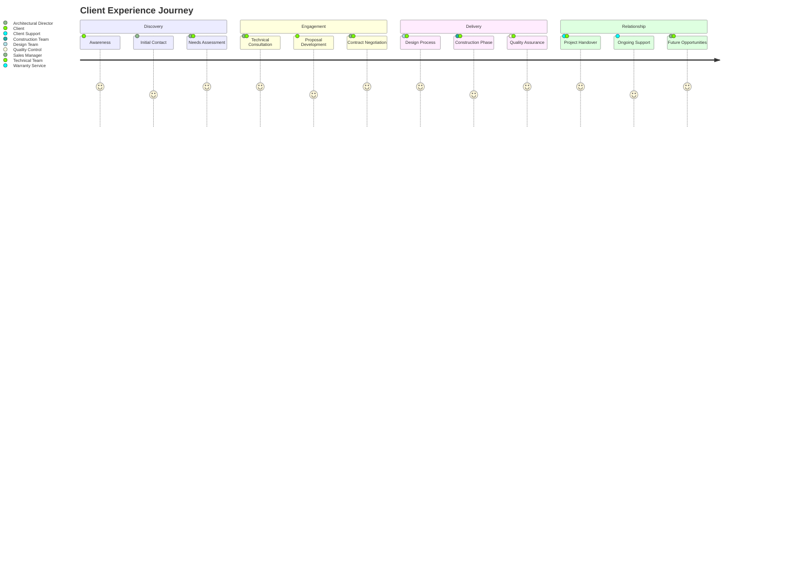
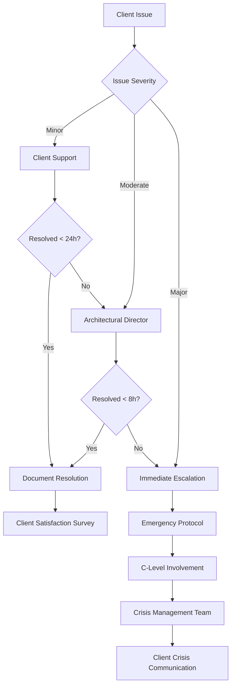

# 👥 Client Management Protocol
*Комплексная система управления клиентскими отношениями*

> *"अतिथि देवो भव" (Atithi Devo Bhava) - "Гость есть Бог" - основополагающий принцип индуистской культуры гостеприимства из Тайттирия Упанишады. В архитектурном бюро клиент - не просто заказчик, а священный гость, достойный высочайшего уважения и заботы.*

---

## 🎯 Strategic Overview

Данный протокол определяет **холистический подход** к управлению клиентскими отношениями, интегрирующий все этапы взаимодействия от первого контакта до послепроектного обслуживания.

### 📊 Client Journey Visualization



### 🏗️ Framework Integration

**Связано с системами:**
- [[07_AGENT_INTERACTION_PROTOCOLS#Client Management Protocols]] - Межагентские взаимодействия
- [[03_HAUS_SYSTEM_MOC#Client Applications]] - Технические решения
- [[04_QUALITY_SYSTEM_MOC#Client Quality Assurance]] - Контроль качества
- [[05_CONSTRUCTION_PROCESS_MOC#Client Communication]] - Строительные процессы

---

## 🔄 Client Lifecycle Management

### 🌟 Phase 1: Discovery & Attraction

#### Lead Generation Strategy
```yaml
lead_generation:
  channels:
    digital_marketing:
      - SEO_optimized_website
      - Google_Ads_campaigns  
      - LinkedIn_B2B_outreach
      - Industry_publication_ads
      
    traditional_marketing:
      - Trade_show_participation
      - Professional_networking
      - Referral_programs
      - Print_advertising
      
    content_marketing:
      - HAUS_technology_whitepapers
      - Case_study_publications
      - Educational_webinars
      - Industry_conference_presentations
      
  responsible_agents:
    primary: Sales_Manager
    supporting: Innovation_Manager, Marketing_Specialist
    
  success_metrics:
    - Lead_volume: >50_qualified_leads/month
    - Conversion_rate: >15%_leads_to_opportunities  
    - Cost_per_lead: <€200
    - Lead_quality_score: >7/10
```

#### Initial Contact Protocol
```yaml
first_contact_process:
  response_timeline:
    phone_inquiry: 15_minutes
    email_inquiry: 2_hours
    web_form: 4_hours
    referral: 1_hour
    
  initial_screening:
    criteria:
      project_scope:
        - Minimum_project_value: €50,000
        - Construction_type: Commercial/Residential
        - HAUS_system_compatibility: Required
        - Timeline: >3_months
      
      client_profile:
        - Decision_making_authority: Confirmed
        - Budget_availability: Verified
        - Geographic_location: Service_area
        - Previous_construction_experience: Assessed
        
  deliverables:
    - Client_qualification_scorecard
    - Initial_project_brief
    - Company_introduction_package
    - Next_steps_timeline
```

### 💼 Phase 2: Qualification & Consultation

#### Needs Assessment Framework
**Responsible:** Sales Manager + Architectural Director

```yaml
needs_assessment:
  discovery_interview:
    duration: 90_minutes
    format: Video_call_or_site_visit
    
    agenda:
      business_objectives: 20_min
        - Company_growth_plans
        - Facility_requirements
        - Operational_constraints
        - Success_criteria
        
      technical_requirements: 30_min
        - Site_characteristics
        - Building_specifications
        - HAUS_system_preferences
        - Energy_efficiency_goals
        
      project_parameters: 25_min
        - Budget_range_confirmation
        - Timeline_expectations
        - Quality_standards
        - Regulatory_requirements
        
      decision_process: 15_min
        - Stakeholder_identification
        - Approval_workflow
        - Evaluation_criteria
        - Competition_landscape
        
  outputs:
    - Detailed_client_profile
    - Technical_requirements_document
    - Project_feasibility_assessment
    - Stakeholder_mapping
```

#### Technical Feasibility Study
**Responsible:** Architectural Director + Technical Team

```yaml
feasibility_study:
  site_analysis:
    responsible: Structural_Designer + Energy_Expert
    activities:
      - Geotechnical_assessment
      - Access_and_logistics_evaluation
      - Utility_availability_check
      - Regulatory_compliance_review
      
  haus_solution_design:
    responsible: Materials_Specialist + Structural_Designer
    activities:
      - Block_type_selection
      - Structural_calculations
      - Thermal_performance_modeling
      - Cost_optimization_analysis
      
  deliverables:
    - Technical_feasibility_report
    - Preliminary_HAUS_specifications
    - Energy_performance_projections
    - Risk_assessment_matrix
    - Implementation_timeline_draft
```

### 📋 Phase 3: Proposal Development & Negotiation

#### Comprehensive Proposal Creation
**Team:** All Technical Agents + Sales Manager

```yaml
proposal_development:
  timeline: 7-10_business_days
  
  document_structure:
    executive_summary: 2_pages
      - Project_overview
      - Key_benefits
      - Investment_summary
      - Next_steps
      
    technical_solution: 8-12_pages
      - HAUS_system_specification
      - Architectural_design_concepts
      - Energy_efficiency_analysis
      - Quality_assurance_plan
      
    implementation_plan: 4-6_pages
      - Project_timeline
      - Resource_allocation
      - Risk_mitigation_strategies
      - Communication_protocols
      
    investment_details: 3-4_pages
      - Detailed_cost_breakdown
      - Payment_schedule
      - Value_engineering_options
      - ROI_analysis
      
    company_credentials: 2-3_pages
      - Team_qualifications
      - Relevant_case_studies
      - Certifications_and_standards
      - Client_references
```

#### Proposal Presentation Protocol
```yaml
presentation_process:
  format: In-person_or_virtual_meeting
  duration: 90_minutes
  participants:
    client_side: Decision_makers + Technical_advisors
    our_side: Architectural_Director + Sales_Manager + Key_specialists
    
  agenda:
    opening: 10_min
      - Welcome_and_introductions
      - Meeting_objectives
      - Agenda_review
      
    solution_presentation: 45_min
      - Problem_understanding_confirmation
      - Technical_solution_walkthrough
      - HAUS_technology_benefits
      - 3D_visualizations_and_renderings
      
    implementation_discussion: 20_min
      - Timeline_review
      - Resource_requirements
      - Quality_control_measures
      - Communication_protocols
      
    investment_review: 10_min
      - Cost_structure_explanation
      - Value_proposition_summary
      - Payment_terms_discussion
      
    next_steps: 5_min
      - Decision_timeline
      - Required_information
      - Follow-up_schedule
```

### ✅ Phase 4: Contract Finalization

#### Contract Negotiation Framework
**Lead:** Sales Manager
**Support:** Architectural Director, Legal Advisor

```yaml
negotiation_process:
  preparation:
    - Contract_template_customization
    - Technical_specifications_finalization
    - Legal_terms_review
    - Pricing_flexibility_parameters
    
  negotiation_areas:
    commercial_terms:
      - Total_project_value
      - Payment_schedule
      - Change_order_procedures
      - Performance_bonuses
      
    technical_specifications:
      - HAUS_block_specifications
      - Quality_standards
      - Testing_requirements
      - Acceptance_criteria
      
    project_management:
      - Timeline_commitments
      - Communication_protocols
      - Reporting_requirements
      - Risk_allocation
      
    legal_framework:
      - Liability_limitations
      - Warranty_terms
      - Dispute_resolution
      - Termination_clauses
      
  success_criteria:
    - Mutually_acceptable_terms
    - Clear_scope_definition
    - Realistic_timeline
    - Appropriate_risk_distribution
```

---

## 🏗️ Project Execution Phase

### 📞 Communication Management

#### Regular Communication Cadence
```yaml
communication_schedule:
  project_initiation:
    frequency: Daily_first_week
    format: Brief_calls_and_emails
    responsible: Architectural_Director
    content:
      - Setup_confirmation
      - Team_introductions
      - Initial_milestone_planning
      
  design_phase:
    frequency: Weekly_progress_meetings
    format: Video_calls_with_presentations
    responsible: Architectural_Director + Design_Team
    content:
      - Design_progress_updates
      - Client_feedback_incorporation
      - Decision_requirements
      - Timeline_adjustments
      
  construction_phase:
    frequency: Daily_status_reports
    format: Email_reports_with_photos
    responsible: Client_Support + Quality_Control
    content:
      - Daily_progress_summary
      - Quality_control_checkpoints
      - Issue_identification_and_resolution
      - Schedule_updates
      
  final_phase:
    frequency: As_needed
    format: Formal_meetings_and_documentation
    responsible: Warranty_Service + Quality_Control
    content:
      - Final_inspections
      - Documentation_handover
      - Training_delivery
      - Warranty_activation
```

#### Issue Escalation Matrix


### 📊 Progress Monitoring & Reporting

#### Client Dashboard System
```yaml
client_dashboard:
  access_method: Secure_web_portal
  update_frequency: Real-time
  
  key_metrics:
    project_progress:
      - Overall_completion_percentage
      - Phase-wise_progress
      - Milestone_achievements
      - Timeline_adherence
      
    quality_indicators:
      - Quality_control_checkpoints_status
      - HAUS_block_installation_quality
      - Compliance_verification_results
      - Issue_resolution_tracking
      
    financial_tracking:
      - Budget_vs_actual_spend
      - Payment_schedule_status
      - Change_order_tracking
      - Cost_variation_analysis
      
    resource_utilization:
      - Team_allocation
      - Material_delivery_status
      - Equipment_utilization
      - Supplier_performance
```

---

## 🔧 Post-Project Relationship Management

### 🛠️ Warranty & Support Framework

#### Comprehensive Warranty Program
**Responsible:** Warranty Service Agent

```yaml
warranty_structure:
  haus_blocks:
    structural_integrity: 25_years
    thermal_performance: 15_years
    surface_quality: 5_years
    manufacturing_defects: 2_years
    
  installation_workmanship:
    structural_installation: 10_years
    waterproofing: 5_years
    finishing_work: 2_years
    mechanical_systems: 1_year
    
  response_commitments:
    emergency_issues: 24_hours
    critical_issues: 72_hours
    non-critical_issues: 1_week
    routine_maintenance: 30_days
    
  coverage_details:
    included_services:
      - Emergency_response
      - Defect_repairs
      - Performance_troubleshooting
      - Technical_consultations
      
    excluded_items:
      - Normal_wear_and_tear
      - Damage_from_misuse
      - Third-party_modifications
      - Force_majeure_events
```

#### Ongoing Support Services
```yaml
support_services:
  preventive_maintenance:
    frequency: Annual_inspections
    scope:
      - HAUS_block_condition_assessment
      - Joint_sealant_inspection
      - Thermal_performance_verification
      - Overall_building_health_check
      
  technical_support:
    availability: Business_hours
    channels:
      - Dedicated_support_hotline
      - Email_support_system
      - On-site_consultation
      - Remote_diagnostics
      
  performance_optimization:
    energy_efficiency_reviews: Annual
    maintenance_planning: Bi-annual
    upgrade_recommendations: As_needed
    best_practices_sharing: Quarterly
```

### 🔄 Relationship Development

#### Client Satisfaction Management
```yaml
satisfaction_monitoring:
  feedback_collection:
    post_milestone_surveys: After_each_major_phase
    project_completion_survey: Within_30_days_of_handover
    annual_relationship_review: Yearly
    
  satisfaction_metrics:
    project_delivery:
      - Timeline_adherence: Target_>90%
      - Budget_compliance: Target_±5%
      - Quality_expectations: Target_>4.5/5
      - Communication_effectiveness: Target_>4.0/5
      
    relationship_quality:
      - Trust_level: Target_>4.5/5
      - Responsiveness: Target_>4.0/5
      - Technical_competence: Target_>4.5/5
      - Overall_satisfaction: Target_>4.3/5
      
  improvement_actions:
    satisfaction_<4.0: Immediate_action_plan
    satisfaction_4.0-4.3: Improvement_initiatives
    satisfaction_>4.3: Best_practice_capture
```

#### Future Opportunity Development
```yaml
relationship_growth:
  account_development:
    responsible: Sales_Manager + Client_Support
    activities:
      - Regular_check-in_calls
      - Industry_trend_sharing
      - Technology_update_presentations
      - Expansion_opportunity_assessment
      
  referral_program:
    incentives:
      - Project_discount_for_referrals
      - Priority_service_status
      - Exclusive_technology_previews
      - Annual_recognition_awards
      
    tracking_metrics:
      - Referral_generation_rate
      - Referral_conversion_rate
      - Client_lifetime_value
      - Advocacy_score
```

---

## 📈 Performance Analytics & Optimization

### 📊 Client Metrics Dashboard

#### Key Performance Indicators
```dataview
TABLE client_name, project_status, satisfaction_score, referral_count
FROM #client-metrics
WHERE year(last_updated) = year(date(today))
SORT satisfaction_score DESC
```

#### Advanced Analytics Framework
```yaml
analytics_system:
  client_segmentation:
    criteria:
      - Project_value_tier
      - Industry_vertical
      - Geographic_location
      - Relationship_duration
      
    segments:
      strategic_accounts: Top_10_value_clients
      growth_accounts: High_potential_prospects  
      maintenance_accounts: Stable_ongoing_relationships
      development_accounts: New_client_cultivation
      
  predictive_analytics:
    churn_risk_modeling:
      - Communication_frequency_patterns
      - Satisfaction_trend_analysis
      - Payment_behavior_patterns
      - Competitive_threat_assessment
      
    upsell_opportunity_identification:
      - Project_expansion_indicators
      - Technology_upgrade_timing
      - Budget_cycle_alignment
      - Strategic_initiative_mapping
```

### 🔄 Continuous Improvement Protocol

#### Feedback Integration System
```yaml
improvement_framework:
  data_collection:
    sources:
      - Client_satisfaction_surveys
      - Project_post-mortems
      - Agent_feedback_sessions
      - Market_research_insights
      
  analysis_process:
    frequency: Monthly_review_meetings
    participants:
      - Architectural_Director
      - Sales_Manager
      - Client_Support
      - Quality_Control
      - Innovation_Manager
      
  improvement_implementation:
    protocol_updates: Quarterly
    training_program_adjustments: Bi-annually
    system_enhancements: As_needed
    best_practice_documentation: Ongoing
```

---

## 🛠️ Tools & Technology Integration

### 💻 CRM System Configuration

#### Client Data Management
```yaml
crm_structure:
  client_profile:
    basic_information:
      - Company_details
      - Contact_hierarchy
      - Communication_preferences
      - Decision_making_process
      
    project_history:
      - Past_projects_database
      - Performance_metrics
      - Lessons_learned
      - Success_stories
      
    relationship_tracking:
      - Interaction_history
      - Satisfaction_scores
      - Referral_activities
      - Future_opportunities
      
  automation_features:
    communication_workflows:
      - Automated_follow-up_sequences
      - Milestone_notification_systems
      - Birthday_and_anniversary_alerts
      - Renewal_reminder_scheduling
      
    reporting_automation:
      - Weekly_client_status_reports
      - Monthly_satisfaction_summaries
      - Quarterly_relationship_reviews
      - Annual_account_planning_data
```

### 📱 Client Portal Technology

#### Self-Service Platform
```yaml
client_portal:
  features:
    project_tracking:
      - Real-time_progress_dashboards
      - Photo_and_video_updates
      - Document_library_access
      - Timeline_visualization
      
    communication_tools:
      - Direct_messaging_system
      - Video_conferencing_integration
      - Document_collaboration
      - Issue_reporting_system
      
    resource_center:
      - HAUS_technology_documentation
      - Maintenance_guidelines
      - Best_practices_library
      - FAQ_database
      
  access_control:
    role_based_permissions: Yes
    secure_authentication: Multi-factor
    data_encryption: End-to-end
    audit_trail: Comprehensive
```

---

## 🎯 Success Metrics & KPIs

### 📊 Client Success Measurement

#### Primary Metrics
```yaml
success_metrics:
  acquisition_metrics:
    - Lead_conversion_rate: Target_>20%
    - Sales_cycle_length: Target_<90_days
    - Customer_acquisition_cost: Target_<€5,000
    - Pipeline_quality_score: Target_>8/10
    
  delivery_metrics:
    - On-time_delivery_rate: Target_>95%
    - Budget_adherence: Target_±3%
    - Quality_score: Target_>4.5/5
    - Client_satisfaction: Target_>4.3/5
    
  retention_metrics:
    - Client_retention_rate: Target_>90%
    - Referral_generation_rate: Target_>25%
    - Upsell_success_rate: Target_>30%
    - Net_promoter_score: Target_>70
    
  relationship_metrics:
    - Communication_effectiveness: Target_>4.0/5
    - Response_time_adherence: Target_>95%
    - Issue_resolution_time: Target_<24h_average
    - Relationship_longevity: Target_>3_years_average
```

---

## 🔗 Integration & Cross-References

### 📊 Knowledge System Connections

**Primary Links:**
- [[07_AGENT_INTERACTION_PROTOCOLS]] - Inter-agent coordination
- [[03_HAUS_SYSTEM_MOC]] - Technical solution delivery
- [[04_QUALITY_SYSTEM_MOC]] - Quality assurance integration
- [[05_CONSTRUCTION_PROCESS_MOC]] - Project execution framework

**Supporting Documentation:**
- [[Client Communication Templates]] - Standardized messaging
- [[Project Delivery Checklists]] - Quality control points
- [[Warranty Service Procedures]] - Post-delivery support
- [[Sales Process Documentation]] - Lead management

### 📈 Dynamic Reporting Integration

```dataview
TABLE client_tier, satisfaction_trend, next_review_date, account_manager
FROM #client-accounts
WHERE active_status = "true"
SORT satisfaction_trend DESC
```

---

**Tags:** #client-management #customer-success #relationship-management #project-delivery #communication-protocols #moc

**Status:** ✅ Active Implementation
**Last Updated:** 2024-01-15
**Next Review:** 2024-02-15
**Owner:** Sales Manager + Client Support Team
**Stakeholders:** All Agent Roles 