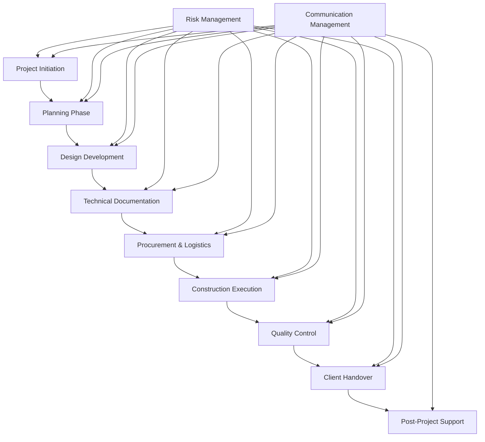

# 📋 Project Management Protocol
*Система управления проектами архитектурного бюро*

> *"यज्ञो भूतभव्यभवत्" (Yajño bhūtabhavyabhavat) - "Жертвоприношение (координированное действие) создает прошлое, настоящее и будущее" - из Ригведы. В управлении проектами каждое согласованное действие создает основу для успешного результата.*

---

## 🎯 Strategic Project Framework

Данный протокол определяет **интегрированную систему управления проектами**, объединяющую методологии Agile, традиционного управления проектами и специфику работы с HAUS технологиями.

### 🏗️ Project Management Architecture



### 📊 Framework Integration

**Связано с системами:**
- [[07_AGENT_INTERACTION_PROTOCOLS#Project Management Protocols]] - Агентские взаимодействия
- [[08_CLIENT_MANAGEMENT_PROTOCOL#Project Execution Phase]] - Клиентская коммуникация
- [[05_CONSTRUCTION_PROCESS_MOC]] - Строительные процессы
- [[04_QUALITY_SYSTEM_MOC#Project Quality Management]] - Контроль качества

---

## 🚀 Project Lifecycle Management

### 📋 Phase 1: Project Initiation

#### Project Charter Development
**Responsible:** Architectural Director + Sales Manager
**Duration:** 3-5 days

```yaml
project_charter:
  project_identification:
    project_name: Descriptive_unique_identifier
    project_code: Format_YYYY-MM-###
    client_information:
      - Primary_contact_details
      - Decision_maker_hierarchy
      - Communication_preferences
      - Stakeholder_mapping
      
  project_scope:
    objectives:
      - Primary_business_objectives
      - Technical_requirements
      - Performance_targets
      - Success_criteria
      
    deliverables:
      - Design_documentation
      - HAUS_material_specifications
      - Construction_drawings
      - Quality_certifications
      - Training_materials
      
    constraints:
      - Budget_limitations
      - Timeline_requirements
      - Site_restrictions
      - Regulatory_requirements
      
    assumptions:
      - Site_access_availability
      - Permit_approval_timeline
      - Weather_considerations
      - Resource_availability
      
  success_criteria:
    performance_metrics:
      - On_time_delivery: Target_100%
      - Budget_adherence: Target_±3%
      - Quality_standards: Target_Zero_defects
      - Client_satisfaction: Target_>4.5/5
      
    acceptance_criteria:
      - All_deliverables_approved
      - Quality_inspections_passed
      - Client_training_completed
      - Documentation_handover_complete
```

#### Stakeholder Analysis & Engagement Plan
```yaml
stakeholder_management:
  internal_stakeholders:
    primary_team:
      - Architectural_Director: Project_oversight
      - Structural_Designer: Technical_design
      - Materials_Specialist: HAUS_specifications
      - Quality_Control: Standards_compliance
      
    supporting_team:
      - Sales_Manager: Client_relationship
      - Client_Support: Communication_facilitation
      - Logistics_Manager: Material_coordination
      - Innovation_Manager: Technology_optimization
      
  external_stakeholders:
    client_organization:
      - Project_sponsor: Decision_authority
      - Technical_team: Implementation_partners
      - End_users: Operational_stakeholders
      - Finance_team: Budget_approval
      
    third_parties:
      - Regulatory_authorities: Permits_and_approvals
      - Suppliers: Material_delivery
      - Subcontractors: Specialized_services
      - Testing_laboratories: Quality_verification
      
  engagement_strategy:
    communication_frequency:
      high_influence_high_interest: Daily_updates
      high_influence_low_interest: Weekly_summaries
      low_influence_high_interest: Bi-weekly_reports
      low_influence_low_interest: Monthly_newsletters
      
    communication_methods:
      - Face-to-face_meetings
      - Video_conferences
      - Email_reports
      - Project_portal_updates
      - Formal_presentations
```

### 📐 Phase 2: Planning & Design

#### Work Breakdown Structure (WBS)
**Responsible:** Architectural Director + Technical Team

```yaml
wbs_structure:
  level_1_phases:
    design_development:
      - Conceptual_design
      - Detailed_design
      - Technical_specifications
      - Drawing_production
      
    material_planning:
      - HAUS_block_selection
      - Quantity_calculations
      - Supplier_coordination
      - Delivery_scheduling
      
    construction_planning:
      - Method_statements
      - Resource_planning
      - Safety_planning
      - Quality_plans
      
    project_management:
      - Communication_protocols
      - Risk_management
      - Change_control
      - Documentation_management
      
  level_2_activities:
    conceptual_design:
      duration: 5-10_days
      dependencies: Project_charter_approval
      resources: Architectural_Director + Structural_Designer
      deliverables:
        - Site_analysis_report
        - Concept_drawings
        - HAUS_system_selection
        - Preliminary_cost_estimate
        
    detailed_design:
      duration: 15-20_days
      dependencies: Conceptual_design_approval
      resources: Full_technical_team
      deliverables:
        - Detailed_drawings
        - Technical_specifications
        - Material_schedules
        - Construction_methodology
```

#### Resource Planning & Allocation
```yaml
resource_management:
  human_resources:
    core_team_allocation:
      Architectural_Director: 40%_project_time
      Structural_Designer: 80%_project_time
      Materials_Specialist: 60%_project_time
      Quality_Control: 30%_project_time
      
    support_team_allocation:
      Technical_Documentation: 50%_project_time
      Energy_Expert: 20%_project_time
      Client_Support: 25%_project_time
      
  material_resources:
    haus_blocks:
      - Block_type_specifications
      - Quantity_requirements
      - Delivery_schedules
      - Quality_certificates
      
    auxiliary_materials:
      - Mortar_and_adhesives
      - Insulation_materials
      - Waterproofing_systems
      - Finishing_materials
      
  equipment_resources:
    design_tools:
      - BIM_software_licenses
      - Calculation_software
      - 3D_modeling_tools
      - Project_management_systems
      
    site_equipment:
      - Material_handling_equipment
      - Quality_testing_instruments
      - Safety_equipment
      - Communication_devices
```

### 🏗️ Phase 3: Execution Management

#### Daily Project Coordination
**Protocol Integration:** [[07_AGENT_INTERACTION_PROTOCOLS#Daily Standup Protocol]]

```yaml
daily_operations:
  morning_standup:
    time: 09:00_daily
    duration: 15_minutes
    participants: Core_project_team
    
    agenda:
      yesterday_progress: 5_min
        - Completed_tasks
        - Achieved_milestones
        - Quality_checkpoints_passed
        
      today_objectives: 5_min
        - Planned_activities
        - Priority_tasks
        - Resource_requirements
        
      blockers_discussion: 5_min
        - Identified_obstacles
        - Resource_constraints
        - Technical_challenges
        - Client_feedback_pending
        
    outputs:
      - Daily_task_assignments
      - Resource_reallocation_decisions
      - Escalation_requirements
      - Communication_actions
      
  progress_tracking:
    task_completion_monitoring:
      - Individual_task_status
      - Milestone_achievement
      - Quality_gate_passage
      - Timeline_adherence
      
    performance_metrics:
      - Productivity_indicators
      - Quality_metrics
      - Resource_utilization
      - Cost_performance
```

#### Weekly Project Reviews
```yaml
weekly_review_process:
  schedule: Every_Friday_15:00
  duration: 60_minutes
  participants: Full_project_team + Key_stakeholders
  
  agenda:
    progress_assessment: 20_min
      - Milestone_achievement_review
      - Task_completion_analysis
      - Quality_metrics_evaluation
      - Timeline_performance_assessment
      
    issue_resolution: 15_min
      - Current_challenges_review
      - Resolution_strategies_discussion
      - Resource_requirement_analysis
      - Escalation_decisions
      
    planning_adjustment: 15_min
      - Next_week_priorities
      - Resource_reallocation
      - Timeline_modifications
      - Risk_mitigation_updates
      
    stakeholder_communication: 10_min
      - Client_update_preparation
      - External_communication_needs
      - Reporting_requirements
      - Meeting_scheduling
      
  deliverables:
    - Weekly_progress_report
    - Updated_project_schedule
    - Risk_register_updates
    - Action_item_assignments
```

### 📊 Phase 4: Monitoring & Control

#### Performance Measurement System
```yaml
kpi_framework:
  schedule_performance:
    metrics:
      - Schedule_Performance_Index_(SPI)
      - Planned_vs_Actual_completion
      - Critical_path_adherence
      - Milestone_achievement_rate
    targets:
      - SPI: >0.95
      - On_time_milestone_completion: >90%
      - Critical_path_variance: <5%
      
  cost_performance:
    metrics:
      - Cost_Performance_Index_(CPI)
      - Budget_vs_Actual_spend
      - Cost_variance_analysis
      - Earned_value_metrics
    targets:
      - CPI: >0.95
      - Budget_variance: ±3%
      - Cost_trend_positive
      
  quality_performance:
    metrics:
      - Defect_density
      - Rework_percentage
      - Quality_gate_passage_rate
      - Client_satisfaction_scores
    targets:
      - Zero_critical_defects
      - Rework_rate: <2%
      - Quality_gate_success: 100%
      - Client_satisfaction: >4.5/5
      
  resource_performance:
    metrics:
      - Resource_utilization_rate
      - Team_productivity_index
      - Material_waste_percentage
      - Equipment_efficiency
    targets:
      - Resource_utilization: >85%
      - Productivity_improvement: >5%_monthly
      - Material_waste: <3%
```

#### Risk Management Protocol
```yaml
risk_management:
  risk_identification:
    categories:
      technical_risks:
        - HAUS_system_performance
        - Design_complexity
        - Integration_challenges
        - Quality_standards_compliance
        
      project_risks:
        - Schedule_delays
        - Resource_availability
        - Budget_overruns
        - Scope_creep
        
      external_risks:
        - Weather_conditions
        - Regulatory_changes
        - Supplier_issues
        - Client_requirement_changes
        
  risk_assessment:
    probability_scale: 1-5_(Very_Low_to_Very_High)
    impact_scale: 1-5_(Negligible_to_Catastrophic)
    risk_score: Probability_×_Impact
    
    risk_categories:
      low_risk: Score_1-5
      medium_risk: Score_6-15
      high_risk: Score_16-25
      
  risk_response:
    strategies:
      avoid: Eliminate_risk_through_planning
      mitigate: Reduce_probability_or_impact
      transfer: Share_risk_with_third_parties
      accept: Acknowledge_and_monitor
      
    contingency_planning:
      - Alternative_approach_identification
      - Resource_buffer_allocation
      - Timeline_adjustment_options
      - Communication_escalation_paths
```

---

## 🔄 Change Management

### 📝 Change Control Process

#### Change Request Protocol
```yaml
change_control:
  change_request_initiation:
    triggers:
      - Client_requirement_changes
      - Technical_specification_updates
      - Regulatory_requirement_changes
      - Design_optimization_opportunities
      
    request_format:
      change_id: Unique_identifier
      change_description: Detailed_explanation
      change_justification: Business_rationale
      impact_analysis:
        - Schedule_impact
        - Cost_impact
        - Resource_impact
        - Quality_impact
        - Risk_impact
        
  evaluation_process:
    technical_assessment:
      responsible: Technical_team_leads
      duration: 2-3_days
      outputs:
        - Feasibility_analysis
        - Technical_impact_assessment
        - Implementation_approach
        - Resource_requirements
        
    business_assessment:
      responsible: Architectural_Director + Sales_Manager
      duration: 1-2_days
      outputs:
        - Cost-benefit_analysis
        - Risk_assessment
        - Client_relationship_impact
        - Strategic_alignment
        
  approval_workflow:
    minor_changes:
      threshold: <5%_budget_impact_or_<1_week_schedule
      approver: Project_Manager
      timeline: 24_hours
      
    major_changes:
      threshold: >5%_budget_impact_or_>1_week_schedule
      approver: Architectural_Director + Client
      timeline: 1_week
      
    critical_changes:
      threshold: Fundamental_scope_changes
      approver: Senior_management + Client_executive
      timeline: 2_weeks
```

### 🔄 Continuous Improvement

#### Lessons Learned Capture
```yaml
knowledge_management:
  periodic_reviews:
    frequency: Bi-weekly_during_project + Post-project
    participants: Full_project_team
    
    review_areas:
      what_worked_well:
        - Successful_practices
        - Effective_tools_and_methods
        - Strong_team_collaborations
        - Client_relationship_successes
        
      areas_for_improvement:
        - Process_inefficiencies
        - Communication_gaps
        - Resource_constraints
        - Technical_challenges
        
      recommendations:
        - Process_modifications
        - Tool_improvements
        - Training_needs
        - Resource_adjustments
        
  knowledge_base_updates:
    documentation_areas:
      - Process_templates
      - Best_practice_guides
      - Lesson_learned_database
      - Training_materials
      
    update_frequency: Monthly
    responsible: Innovation_Manager + Project_leads
```

---

## 📱 Project Management Tools & Technology

### 🖥️ Digital Project Management Platform

#### Core System Architecture
```yaml
pm_system_requirements:
  project_planning:
    features:
      - Gantt_chart_creation
      - Resource_allocation_planning
      - Critical_path_analysis
      - Milestone_tracking
      
    integration:
      - Calendar_systems
      - Resource_management_tools
      - Budget_tracking_systems
      - Risk_management_modules
      
  collaboration_tools:
    features:
      - Real-time_document_collaboration
      - Video_conferencing_integration
      - Team_messaging_systems
      - File_sharing_capabilities
      
    accessibility:
      - Mobile_application_support
      - Cloud-based_access
      - Offline_functionality
      - Multi-language_support
      
  reporting_analytics:
    features:
      - Real-time_dashboard_views
      - Customizable_report_generation
      - Performance_analytics
      - Predictive_forecasting
      
    outputs:
      - Executive_summary_reports
      - Detailed_progress_reports
      - Resource_utilization_analysis
      - Risk_assessment_summaries
```

### 📊 Integration with HAUS Systems

#### BIM Integration Protocol
**Связано:** [[03_HAUS_SYSTEM_MOC#BIM Integration]]

```yaml
bim_integration:
  model_management:
    centralized_model_repository:
      - Single_source_of_truth
      - Version_control_system
      - Access_permission_management
      - Change_tracking_capabilities
      
    multi-disciplinary_coordination:
      - Architectural_model_integration
      - Structural_model_overlay
      - MEP_systems_coordination
      - HAUS_block_specification_embedding
      
  data_exchange:
    formats:
      - IFC_for_interoperability
      - Native_BIM_formats
      - 2D_drawing_extraction
      - 3D_visualization_outputs
      
    automation:
      - Quantity_take-off_generation
      - Material_scheduling_automation
      - Cost_estimation_integration
      - Progress_tracking_visualization
```

---

## 🎯 Quality Management Integration

### ✅ Quality Gates Framework
**Связано:** [[04_QUALITY_SYSTEM_MOC#Quality Gates]]

#### Project Quality Gates
```yaml
quality_gates:
  gate_0_project_initiation:
    criteria:
      - Project_charter_approved
      - Stakeholder_agreement_confirmed
      - Resource_allocation_finalized
      - Risk_assessment_completed
    responsible: Architectural_Director
    timeline: Project_start_+_3_days
    
  gate_1_design_completion:
    criteria:
      - All_design_documents_approved
      - HAUS_specifications_validated
      - Client_design_sign-off_received
      - Technical_reviews_completed
    responsible: Quality_Control + Architectural_Director
    timeline: Design_phase_completion
    
  gate_2_construction_readiness:
    criteria:
      - Material_procurement_confirmed
      - Installation_procedures_approved
      - Quality_control_plan_activated
      - Site_preparation_completed
    responsible: Quality_Control + Logistics_Manager
    timeline: Pre-construction_phase
    
  gate_3_project_completion:
    criteria:
      - All_construction_completed
      - Quality_inspections_passed
      - Client_acceptance_received
      - Documentation_handover_complete
    responsible: Quality_Control + Client_Support
    timeline: Project_finalization
```

### 📋 Quality Assurance Activities
```yaml
qa_activities:
  design_quality:
    reviews:
      - Peer_design_reviews
      - Technical_standard_compliance
      - HAUS_specification_verification
      - Client_requirement_validation
    frequency: Weekly_during_design_phase
    
  process_quality:
    audits:
      - Project_management_process_audits
      - Communication_effectiveness_reviews
      - Documentation_quality_checks
      - Stakeholder_satisfaction_surveys
    frequency: Bi-weekly_throughout_project
    
  product_quality:
    inspections:
      - Material_quality_verification
      - Installation_workmanship_checks
      - Performance_testing_validation
      - Final_product_acceptance
    frequency: Daily_during_construction
```

---

## 📈 Performance Analytics & Reporting

### 📊 Project Dashboard System

#### Real-Time Monitoring
```yaml
dashboard_configuration:
  executive_view:
    metrics:
      - Overall_project_health_status
      - Budget_performance_summary
      - Schedule_adherence_indicator
      - Quality_score_overview
      - Client_satisfaction_rating
    update_frequency: Real-time
    access_level: Senior_management + Client_executives
    
  project_manager_view:
    metrics:
      - Detailed_task_completion_status
      - Resource_utilization_breakdown
      - Risk_register_status
      - Issue_tracking_summary
      - Team_performance_indicators
    update_frequency: Hourly
    access_level: Project_team_leads
    
  team_member_view:
    metrics:
      - Individual_task_assignments
      - Daily_objectives_status
      - Quality_checkpoint_requirements
      - Communication_updates
      - Document_access_links
    update_frequency: Real-time
    access_level: All_team_members
```

#### Advanced Analytics
```dataview
TABLE project_name, completion_percentage, budget_variance, quality_score
FROM #active-projects
WHERE status = "in-progress"
SORT completion_percentage DESC
```

### 📊 Predictive Analytics Framework
```yaml
predictive_analytics:
  schedule_forecasting:
    algorithms:
      - Earned_value_analysis
      - Critical_path_method_simulation
      - Monte_Carlo_schedule_analysis
      - Resource_leveling_optimization
    outputs:
      - Completion_date_predictions
      - Schedule_risk_assessments
      - Resource_conflict_forecasts
      - Milestone_achievement_probabilities
      
  cost_forecasting:
    algorithms:
      - Trend_analysis_models
      - Regression_analysis_techniques
      - Budget_variance_extrapolation
      - Resource_cost_optimization
    outputs:
      - Final_cost_estimates
      - Budget_overrun_predictions
      - Cost_optimization_recommendations
      - Cash_flow_forecasts
      
  quality_prediction:
    algorithms:
      - Defect_density_modeling
      - Process_capability_analysis
      - Historical_performance_trending
      - Risk-based_quality_assessment
    outputs:
      - Quality_risk_indicators
      - Inspection_frequency_optimization
      - Resource_quality_allocation
      - Client_satisfaction_predictions
```

---

## 🔗 Integration & Cross-References

### 📊 Knowledge System Connections

**Primary Integration Points:**
- [[07_AGENT_INTERACTION_PROTOCOLS]] - Team coordination protocols
- [[08_CLIENT_MANAGEMENT_PROTOCOL]] - Client relationship management
- [[03_HAUS_SYSTEM_MOC]] - Technical implementation
- [[04_QUALITY_SYSTEM_MOC]] - Quality assurance processes
- [[05_CONSTRUCTION_PROCESS_MOC]] - Construction execution

**Supporting Documentation:**
- [[Project Templates]] - Standardized project artifacts
- [[Risk Management Database]] - Historical risk data
- [[Resource Planning Tools]] - Allocation algorithms
- [[Performance Metrics Library]] - KPI definitions

### 📈 Dynamic Content Integration

```dataview
TABLE project_status, team_allocation, next_milestone, risk_level
FROM #project-management
WHERE active = true
SORT next_milestone ASC
```

---

## 🎯 Implementation Roadmap

### 🚀 Deployment Strategy

#### Phase 1: Foundation Setup (Weeks 1-2)
- [ ] Project management system deployment
- [ ] Team training completion
- [ ] Template library creation
- [ ] Integration testing

#### Phase 2: Process Implementation (Weeks 3-4)
- [ ] Pilot project execution
- [ ] Feedback collection and analysis
- [ ] Process refinement
- [ ] Documentation updates

#### Phase 3: Full Rollout (Weeks 5-6)
- [ ] All projects migration
- [ ] Performance monitoring activation
- [ ] Continuous improvement implementation
- [ ] Success metrics evaluation

### 📋 Success Criteria
```yaml
implementation_success:
  quantitative_targets:
    - Project_delivery_time_improvement: >10%
    - Budget_adherence_rate: >95%
    - Quality_defect_reduction: >20%
    - Client_satisfaction_increase: >0.3_points
    
  qualitative_indicators:
    - Improved_team_collaboration
    - Enhanced_communication_effectiveness
    - Streamlined_decision_making_processes
    - Increased_project_predictability
```

---

**Tags:** #project-management #agile-methodology #haus-construction #team-coordination #quality-control #performance-analytics #moc

**Status:** ✅ Active Implementation
**Last Updated:** 2024-01-15
**Next Review:** 2024-02-01
**Owner:** Architectural Director + Project Management Team
**Stakeholders:** All Project Team Members 